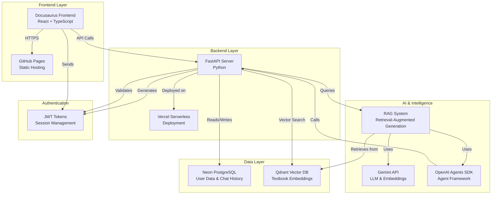
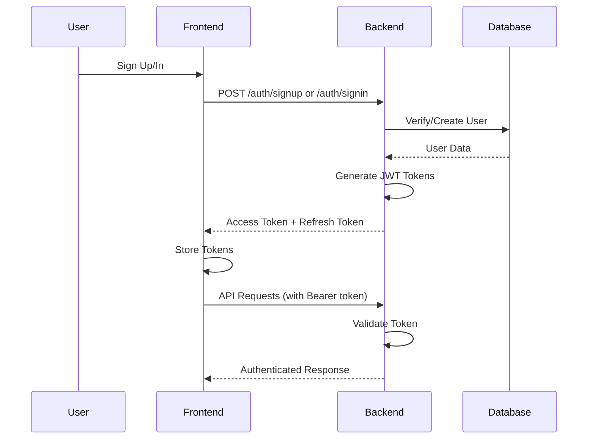
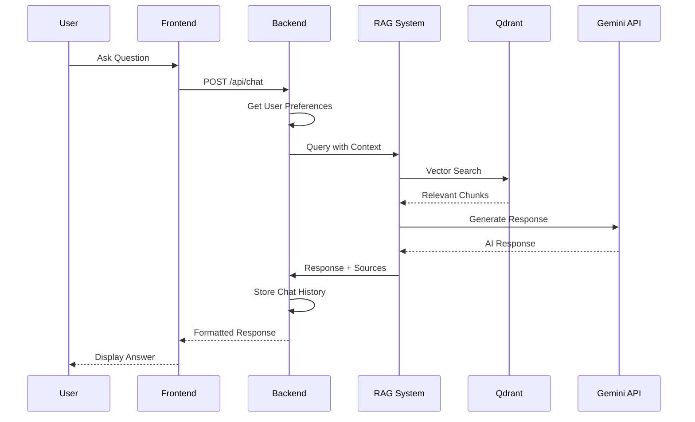

# System Architecture

This document describes the high-level architecture of the Physical AI & Humanoid Robotics Interactive Textbook platform.

## Architecture Diagram

## Component Overview

### Frontend (Docusaurus)

**Technology Stack:**
- React 19
- TypeScript
- Docusaurus 3.9.2
- Tailwind CSS

**Key Components:**
- **ChatPanel**: Interactive chatbot interface
- **PersonalizationControls**: User preference management
- **TranslationSwitcher**: Language selection
- **ChapterDropdown**: Navigation component
- **AuthContext**: Authentication state management

**Deployment:**
- Built as static site
- Deployed to GitHub Pages via GitHub Actions
- URL: `https://abdul-kabir-jawed.github.io/agentic_ai_project/`

### Backend (FastAPI)

**Technology Stack:**
- FastAPI
- Python 3.12
- Uvicorn (ASGI server)

**Key Endpoints:**
- `/auth/signup` - User registration
- `/auth/signin` - User authentication
- `/api/chat` - Chatbot interaction
- `/api/personalization` - User preferences
- `/health` - Health check

**Deployment:**
- Serverless deployment on Vercel
- URL: `https://agenticaiproject.vercel.app/`

### RAG System

**Components:**
1. **Content Indexing**: 
   - Chunks textbook chapters
   - Generates embeddings using Gemini
   - Stores in Qdrant vector database

2. **Retrieval**:
   - Receives user query
   - Searches Qdrant for relevant chunks
   - Returns top-k most relevant content

3. **Generation**:
   - Uses OpenAI Agents SDK
   - Combines retrieved context with user query
   - Generates personalized response
   - Includes source citations

### Database Layer

**Neon PostgreSQL:**
- **Tables:**
  - `users`: User accounts and preferences
  - `sessions`: JWT refresh tokens
- **Purpose**: User data, authentication, chat history

**Qdrant Vector Database:**
- **Collection**: `physical_ai_textbook`
- **Vector Dimension**: 768 (Gemini embeddings)
- **Purpose**: Semantic search over textbook content

### Authentication Flow

### Chat Flow

## Data Flow

### User Registration Flow

1. User fills signup form
2. Frontend sends POST to `/auth/signup`
3. Backend hashes password with bcrypt
4. User record created in PostgreSQL
5. JWT tokens generated
6. Tokens returned to frontend
7. Frontend stores tokens in localStorage

### Chat Interaction Flow

1. User types question in chat
2. Frontend sends query to `/api/chat`
3. Backend retrieves user preferences (language, technical level)
4. RAG system searches Qdrant for relevant content
5. Agent combines context with user query
6. Gemini API generates response
7. Response includes source citations
8. Chat history saved to database
9. Response returned to frontend

### Personalization Flow

1. User updates preferences
2. Frontend sends PUT to `/api/personalization`
3. Backend updates user record
4. Preferences stored in database
5. Future chat responses use new preferences

## Security Considerations

- **JWT Tokens**: Secure token-based authentication
- **Password Hashing**: bcrypt with salt
- **CORS**: Configured for specific origins
- **Environment Variables**: Sensitive data stored securely
- **HTTPS**: All production traffic encrypted

## Scalability

- **Frontend**: Static site, scales automatically via CDN
- **Backend**: Serverless, auto-scales with Vercel
- **Database**: Neon PostgreSQL with connection pooling
- **Vector DB**: Qdrant Cloud with horizontal scaling

## Monitoring & Observability

- **Health Endpoint**: `/health` for system status
- **Error Logging**: Structured error messages
- **Database Monitoring**: Connection status tracking

## Future Enhancements

- Real-time chat via WebSockets
- Advanced caching layer (Redis)
- Analytics and usage tracking
- Multi-language content support expansion
- Advanced personalization algorithms

