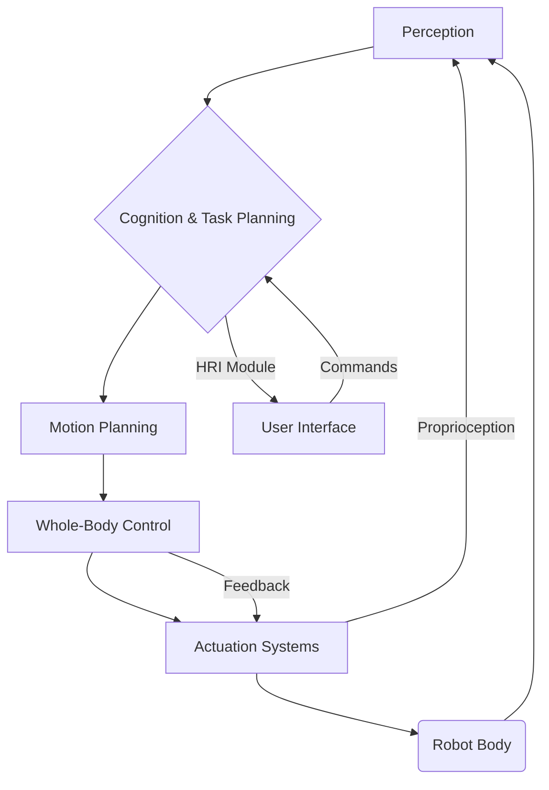

# Chapter 3: Humanoid Robotics Overview

## Introduction

Humanoid robotics represents one of the most ambitious and captivating frontiers in engineering and artificial intelligence. These robots, designed to mimic the human form and often human behaviors, stand at the intersection of biomechanics, control theory, machine learning, and human-robot interaction. From science fiction dreams to tangible laboratory prototypes and emerging commercial applications, humanoids promise to redefine our interaction with technology, stepping into roles ranging from industrial assistance to personal companionship and hazardous environment exploration.

This chapter provides a comprehensive overview of humanoid robotics, delving into the motivations behind their development, exploring iconic examples, dissecting the formidable engineering challenges they present, and examining the cutting edge of research and development in this dynamic field. We will explore how these machines are not just mechanical marvels but also platforms for understanding intelligence, locomotion, and interaction in complex, human-centric environments.

## Learning Objectives

By the end of this chapter, readers should be able to:

1.  **Articulate the primary motivations and advantages** for developing humanoid robots, including their potential impact on various sectors.
2.  **Identify and briefly describe notable humanoid robots**, recognizing their historical significance, unique capabilities, and contributions to the field.
3.  **Analyze and explain the key design challenges** inherent in humanoid robotics, such as balance, locomotion, manipulation, power management, and safety.
4.  **Discuss the current state of the art** in humanoid robotics, including recent advancements in control, AI integration, perception, and materials.
5.  **Understand a simplified concept of balance control** through a practical code example.

## 3.1 Why Humanoid Robots?

The pursuit of creating robots in our own image is driven by a blend of practical utility, scientific curiosity, and philosophical inquiry. Humanoid robots are not merely an exercise in biomimicry; they offer distinct advantages and fulfill specific needs that other robotic forms cannot.

### 3.1.1 Advantages and Motivations

The primary motivations for developing humanoid robots stem from their potential to seamlessly integrate into environments and systems designed for humans.

*   **Operating in Human-Centric Environments:** Our world—from homes and offices to factories and hospitals—is built for the human body. Staircases, doors, tools, and vehicles are all ergonomically designed for bipedal locomotion and dexterous manipulation. Humanoid robots, with their similar morphology, are uniquely positioned to operate within these existing infrastructures without requiring extensive modifications. This reduces deployment costs and vastly expands their potential application areas.
*   **Leveraging Human Tools and Interfaces:** Standard tools, controls, and machinery are designed to be operated by human hands and bodies. A humanoid robot, with its two arms, two legs, and articulated hands, can theoretically use the same wrenches, operate the same control panels, and drive the same vehicles as humans, thereby expanding their utility dramatically.
*   **Social Interaction and Acceptance:** The human form elicits a natural sense of familiarity and empathy in humans. For tasks involving direct interaction with people, such as caregiving, education, or customer service, a humanoid appearance can foster greater trust, understanding, and acceptance compared to abstract or industrial robot designs. This aspect is crucial for applications in service industries and personal assistance.
*   **Disaster Response and Hazardous Environments:** Humanoid robots can be deployed in dangerous situations that are too risky for humans, such as disaster zones, nuclear facilities, or space exploration. Their ability to navigate complex terrain and manipulate objects could make them invaluable for search and rescue, hazardous waste cleanup, and construction in extreme conditions.
*   **Research Platforms:** Humanoid robots serve as unparalleled platforms for fundamental research into intelligence, locomotion, perception, and control. By attempting to replicate human capabilities, scientists gain deeper insights into human motor control, cognitive processes, and the principles of general intelligence. They push the boundaries of materials science, actuation systems, and AI algorithms.

## 3.2 Notable Humanoid Robots

The history of humanoid robotics is punctuated by several groundbreaking creations that have pushed the boundaries of what is possible. Each robot represents a significant milestone in the journey toward achieving human-like capabilities.

### 3.2.1 Boston Dynamics Atlas

Atlas, developed by Boston Dynamics, is perhaps the most famous and agile humanoid robot to date. Known for its incredible dynamic balance and athletic feats, Atlas has demonstrated capabilities such as running, jumping over obstacles, performing parkour, and even executing backflips. Originally developed for DARPA Robotics Challenge, Atlas is a research platform that utilizes advanced hydraulic actuation for powerful and precise movements, coupled with sophisticated control algorithms for dynamic stability. It serves as a testament to the potential for robust, dynamic locomotion and manipulation in complex environments.

### 3.2.2 Tesla Optimus

Tesla Bot, or Optimus, represents a different philosophy: a general-purpose, mass-producible humanoid robot designed for mundane, repetitive tasks that humans prefer not to do. Announced in 2021, Optimus aims for commercial viability and large-scale deployment, particularly in manufacturing and logistics. Its design emphasizes low cost, ease of manufacturing, and AI capabilities for learning and adapting to various tasks, with a focus on vision-based control and energy efficiency.

### 3.2.3 Figure 01

Figure 01, from Figure AI, is another prominent example of a general-purpose humanoid robot designed for practical applications, particularly in logistics and manufacturing. Like Optimus, Figure 01 emphasizes AI-driven control and a focus on human-like dexterity and manipulation. Recent demonstrations highlight its ability to perform complex tasks, learn from human demonstrations, and engage in natural language interaction, showcasing rapid advancements in integrated AI capabilities for physical tasks.

### 3.2.4 Honda ASIMO

Honda's ASIMO (Advanced Step in Innovative Mobility) is a pioneering humanoid robot, first introduced in 2000. ASIMO was instrumental in popularizing humanoid robotics and demonstrating stable bipedal locomotion, stair climbing, and basic manipulation tasks. It showcased the potential for human-robot interaction, greeting people, and performing simple service tasks. While more constrained in dynamic movement compared to modern hydraulic robots, ASIMO's development significantly advanced the understanding of bipedal walking and humanoid control.

### 3.2.5 Other Notable Humanoids

*   **Digit (Agility Robotics):** A bipedal robot designed for logistics and last-mile delivery, featuring efficient locomotion and the ability to carry packages.
*   **WALK-MAN (IIT):** Developed for disaster response, focusing on robust locomotion and manipulation in challenging, unstructured environments.
*   **HRP-5P (AIST):** A heavy-duty humanoid designed for construction tasks, capable of handling large and heavy objects.

## 3.3 Design Challenges in Humanoid Robotics

Creating a robot that can reliably navigate and operate in human environments is an incredibly complex engineering feat. Humanoid robots face a unique set of design challenges that push the boundaries of current technology.

### 3.3.1 Balance and Stability

Maintaining balance is arguably the most fundamental and difficult challenge for bipedal humanoids. Unlike wheeled or tracked robots, humanoids have a small support base and a high center of gravity, making them inherently unstable.
*   **Dynamic Stability:** This involves continuously adjusting the robot's center of mass (CoM) and zero moment point (ZMP) to prevent falling, especially during locomotion, manipulation, or unexpected perturbations.
*   **Disturbance Rejection:** Robots must be able to withstand pushes, uneven terrain, and slippery surfaces without losing balance.
*   **Whole-Body Control:** Coordinated control of all joints and contact points (feet, hands, torso) is essential for sophisticated balance and interaction.

### 3.3.2 Locomotion

Efficient, robust, and versatile locomotion is critical.
*   **Bipedal Walking:** Generating natural, energy-efficient gaits on flat ground is challenging, but even more so on uneven terrain, stairs, or inclines.
*   **Running and Jumping:** Requires highly dynamic control, powerful actuators, and precise timing.
*   **Footstep Planning:** Deciding where to place feet to navigate obstacles and maintain stability.

### 3.3.3 Manipulation

Human hands are incredibly dexterous, capable of fine motor skills and powerful grasping. Replicating this in robots is hard.
*   **Dexterous Hands:** Designing multi-fingered grippers with sufficient degrees of freedom, sensing capabilities (touch, force), and compliant materials is complex.
*   **Grasping and Object Recognition:** Robots need to identify objects, estimate their properties (weight, friction), and plan appropriate grasps.
*   **Force Control:** Applying the right amount of force for delicate tasks or robust handling, crucial for safe interaction with the environment and humans.

### 3.3.4 Power and Energy Management

Humanoids require significant power for their numerous motors and sensors, but also need to be lightweight and operate for extended periods.
*   **Battery Life:** High-density, lightweight batteries are essential but often limit operational duration.
*   **Actuation Systems:** Choosing between powerful hydraulic systems (like Atlas) with their associated weight and maintenance, or more energy-efficient and quieter electric actuators (like Optimus) with potentially less peak power.
*   **Heat Dissipation:** Powerful motors generate heat, requiring efficient cooling systems.

### 3.3.5 Safety and Human-Robot Interaction (HRI)

As humanoids move into shared spaces, safety becomes paramount.
*   **Collision Avoidance:** Detecting humans and obstacles and planning paths to avoid collisions.
*   **Soft Robotics and Compliance:** Designing robots that are physically compliant or have soft exteriors to reduce injury risk in case of impact.
*   **Predictable Behavior:** Ensuring robot actions are understandable and predictable to humans to foster trust and prevent accidents.
*   **Ethical Considerations:** Addressing societal impact, job displacement, and the ethical implications of autonomous human-like machines.

### 3.3.6 Cost and Commercial Viability

The high research and development costs, coupled with complex manufacturing, make humanoids expensive.
*   **Component Costs:** High-performance sensors, actuators, and controllers are costly.
*   **Manufacturing Complexity:** Assembling numerous intricate parts with high precision.
*   **Maintenance:** Complex systems often require specialized maintenance.
*   **Scalability:** Achieving mass production at a cost that makes them viable for broad commercial deployment.

## 3.4 Current State of the Art and Research Directions

Recent years have seen rapid advancements in humanoid robotics, driven by breakthroughs in AI, control theory, and materials science.

### 3.4.1 Advanced Control Systems

*   **Whole-Body Control (WBC):** Modern humanoids utilize WBC frameworks that coordinate all degrees of freedom (DOF) to achieve complex tasks while maintaining balance and respecting joint limits and contact forces. This allows for dynamic and agile movements, including locomotion and manipulation, to be integrated seamlessly.
*   **Model Predictive Control (MPC):** MPC is increasingly used for real-time optimal control, allowing robots to anticipate future states and plan actions to maintain stability and achieve goals efficiently.

### 3.4.2 AI and Machine Learning Integration

*   **Deep Reinforcement Learning (DRL):** DRL is revolutionizing gait generation, manipulation policies, and robust behavior in unstructured environments. Robots can learn complex motor skills through trial and error in simulation, which are then transferred to the real world (sim-to-real transfer).
*   **Large Language Models (LLMs) and Vision Transformers (ViTs):** The integration of advanced AI models allows humanoids to understand high-level natural language commands, perform complex reasoning, plan multi-step tasks, and interpret visual information with unprecedented accuracy. This enables more intuitive human-robot interaction and greater autonomy.
*   **Imitation Learning:** Robots are learning skills by observing human demonstrations, making programming more accessible and enabling faster skill acquisition.

### 3.4.3 Enhanced Perception and Cognition

*   **Multi-Modal Sensing:** Integration of advanced cameras (RGB-D, event cameras), LiDAR, force/torque sensors, and proprioceptive sensors provides a comprehensive understanding of the robot's internal state and external environment.
*   **Cognitive Architectures:** Development of frameworks that allow robots to reason, learn, plan, and adapt, moving beyond pre-programmed responses to more intelligent, autonomous behavior.

### 3.4.4 Materials and Actuation

*   **Lightweight and Strong Materials:** Use of advanced composites reduces robot weight, improving efficiency and dynamic performance.
*   **High-Power Density Actuators:** Continuous development of electric motors and hydraulic systems that deliver higher power in smaller, lighter packages.
*   **Series Elastic Actuators (SEAs):** Incorporating compliant elements in actuators allows for safer human-robot interaction, better force control, and improved disturbance rejection.

## 3.5 Code Example: Simplified Balance Control

To illustrate a fundamental concept in humanoid control, let's consider a simplified 2D balance control problem using a Proportional-Derivative (PD) controller. Imagine a humanoid robot approximated as an inverted pendulum with a single joint at the \"hip,\" trying to maintain an upright position. The controller adjusts the hip torque based on the robot's angle and angular velocity.

**Concept:** A PD controller calculates an output (torque in this case) based on the current error (deviation from desired angle) and the rate of change of that error (angular velocity).

```python
import numpy as np
import matplotlib.pyplot as plt

# --- Robot Parameters ---
# Mass of the robot (approximated as a point mass at the top of the pendulum)
M = 10.0  # kg
# Length of the pendulum (distance from hip joint to CoM)
L = 1.0   # meters
# Moment of inertia (for a point mass at L)
I = M * L**2
# Gravity
G = 9.81  # m/s^2

# --- PD Controller Gains ---
Kp = 100.0  # Proportional gain for angle error
Kd = 20.0   # Derivative gain for angular velocity

# --- Simulation Parameters ---
dt = 0.01   # Time step (seconds)
T_end = 5.0 # Total simulation time
num_steps = int(T_end / dt)

# --- Initial State ---
# Angle from vertical (radians, 0 = upright). Start slightly tilted.
theta = 0.1
# Angular velocity (rad/s)
theta_dot = 0.0

# --- Store Data for Plotting ---
time_history = np.zeros(num_steps)
theta_history = np.zeros(num_steps)
theta_dot_history = np.zeros(num_steps)
torque_history = np.zeros(num_steps)

print("Starting simplified balance control simulation...")

# --- Simulation Loop ---
for i in range(num_steps):
    # Calculate error: desired angle (0 for upright) - current angle
    error = 0.0 - theta
    # Calculate derivative error: desired angular velocity (0 for upright) - current angular velocity
    error_dot = 0.0 - theta_dot

    # PD Control Law: Calculate torque to apply at the hip joint
    torque = Kp * error + Kd * error_dot

    # --- Dynamics of an Inverted Pendulum (Simplified) ---
    # Equation of motion: I * theta_double_dot = M * G * L * sin(theta) + torque
    # where M * G * L * sin(theta) is the gravitational torque trying to pull it down
    # and `torque` is our control input.
    # Note: sin(theta) is approximated as theta for small angles, but we use sin for accuracy.

    # Calculate angular acceleration
    theta_double_dot = (M * G * L * np.sin(theta) + torque) / I

    # Integrate to update state (Euler method)
    theta_dot += theta_double_dot * dt
    theta += theta_dot * dt

    # --- Store values ---
    time_history[i] = i * dt
    theta_history[i] = theta
    theta_dot_history[i] = theta_dot
    torque_history[i] = torque

print("Simulation finished. Plotting results...")

# --- Plotting Results ---
plt.figure(figsize=(12, 8))

plt.subplot(3, 1, 1)
plt.plot(time_history, np.degrees(theta_history))
plt.title('Humanoid Balance Control (Simplified 2D)')
plt.ylabel('Angle (degrees)')
plt.grid(True)

plt.subplot(3, 1, 2)
plt.plot(time_history, np.degrees(theta_dot_history))
plt.ylabel('Angular Velocity (degrees/s)')
plt.grid(True)

plt.subplot(3, 1, 3)
plt.plot(time_history, torque_history)
plt.xlabel('Time (s)')
plt.ylabel('Control Torque (Nm)')
plt.grid(True)

plt.tight_layout()
plt.show()

print("\nExplanation:")
print("This simulation models a simplified humanoid as an inverted pendulum.")
print("A PD controller attempts to keep the 'robot' upright (angle = 0).")
print("Kp (proportional gain) drives the system towards the target angle based on the current deviation.")
print("Kd (derivative gain) dampens oscillations and provides stability based on the rate of change of the angle.")
print("You should observe the angle quickly returning to 0 and stabilizing, demonstrating basic balance control.")
```

**Setup and Run Instructions:**

1.  **Save the code:** Save the code above as `balance_control_example.py`.
2.  **Install dependencies:** If you don't have them, install `numpy` and `matplotlib`:
    ````bash
    pip install numpy matplotlib
    ````
3.  **Run the script:** Execute the Python script from your terminal:
    ````bash
    python balance_control_example.py
    ````
    This will run the simulation and display three plots showing the angle, angular velocity, and control torque over time. You should observe the robot's angle quickly stabilizing around zero, demonstrating the effect of the PD controller in maintaining balance.

### 3.5.1 Humanoid Robot System Architecture

Humanoid robots are complex integrated systems. Below is a high-level architectural diagram illustrating the main components and their interactions.


**Figure 3.1:** Simplified Humanoid Robot System Architecture. This diagram illustrates the flow from sensory input (Perception) through intelligent processing (Cognition & Task Planning, Motion Planning), to physical execution (Whole-Body Control, Actuation Systems, Robot Body), with continuous feedback loops and human interaction.

## 3.6 Exercises

1.  **Conceptual Analysis:** Discuss how the \"curse of dimensionality\" impacts the design and control of humanoid robots, particularly in areas like motion planning and learning from demonstration. How do researchers attempt to mitigate this challenge?
2.  **Comparative Study:** Choose two contemporary humanoid robots (e.g., Boston Dynamics Atlas vs. Figure 01 or Tesla Optimus) and perform a comparative analysis of their design philosophies, actuation methods, primary application targets, and perceived advantages/disadvantages.
3.  **PD Controller Tuning:** In the provided Python code example for simplified balance control, modify the `Kp` and `Kd` gains. Observe and describe the changes in the robot's stability and response (e.g., does it become more oscillatory, slower to respond, or unstable?). Explain why these changes occur based on the principles of PD control.
4.  **Ethical Discussion:** Envision a future where humanoid robots are ubiquitous in everyday life (e.g., caregivers, service workers). Identify and discuss three significant ethical considerations or societal impacts that would need to be addressed before such widespread adoption.

## 3.7 References

1.  **For Atlas Robotics:** Boston Dynamics Official Website. (Accessed 2024). [https://www.bostondynamics.com/atlas/](https://www.bostondynamics.com/atlas/)
2.  **For Tesla Optimus:** Tesla AI Day presentations and official announcements. (Accessed 2024).
3.  **For Figure 01:** Figure AI Official Website. (Accessed 2024). [https://www.figure.ai/](https://www.figure.ai/)
4.  **For ASIMO:** Honda Global Official Website. (Accessed 2024). [https://global.honda/innovation/robotics/ASIMO.html](https://global.honda/innovation/robotics/ASIMO.html)
5.  **For General Humanoid Robotics & Control:**
    *   Siciliano, B., & Khatib, O. (Eds.). (2016). *Springer Handbook of Robotics*. Springer. (A comprehensive reference for advanced topics).
    *   Pons, J. L. (2008). *Wearable Robots: Biomechatronic Exoskeletons*. John Wiley & Sons. (Relevant for actuation and human-robot interaction).
6.  **For AI and Learning in Robotics:**
    *   Kober, J., Bagnell, J. A., & Peters, J. (2013). Reinforcement learning in robotics: A survey. *International Journal of Robotics Research*, 32(11), 1238-1274. (A foundational survey).
    *   Levine, S., Finn, C., Darrell, T., & Abbeel, P. (2016). End-to-end training of deep visuomotor policies. *Journal of Machine Learning Research*, 17(39), 1-40. (Key paper on deep learning for control).
7.  **Recent Advancements (2023-2025):** Continuously evolving field; refer to proceedings of major robotics conferences such as ICRA (International Conference on Robotics and Automation), IROS (Intelligent Robots and Systems), and RSS (Robotics: Science and Systems) for the latest research. Specific papers on Whole-Body Control, DRL for locomotion, and LLM integration with robotics are highly dynamic and best found through recent academic searches.