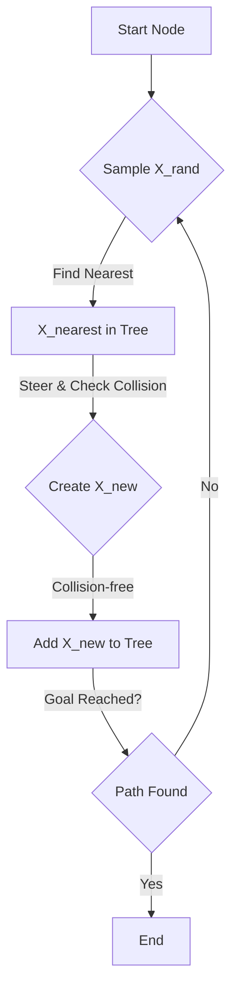

# Chapter 4: Navigation and Path Planning

## Introduction

Robots capable of autonomous operation in complex environments are no longer confined to the realm of science fiction. From industrial automation to self-driving cars and exploration rovers, autonomous navigation is a cornerstone of modern robotics. This chapter delves into the fundamental principles and advanced techniques that enable robots to understand their surroundings, pinpoint their location, chart a course, and execute movements with precision. We will explore the intricate interplay between sensing, perception, localization, mapping, and motion control that culminates in truly intelligent robotic navigation.

## Learning Objectives

Upon completing this chapter, you will be able to:

1.  **Explain** the core concepts of robot localization and differentiate between various localization techniques (e.g., Kalman Filters, Particle Filters).
2.  **Describe** different mapping strategies, including occupancy grids and feature maps, and their respective advantages and disadvantages.
3.  **Implement** and compare various path planning algorithms, such as A*, Dijkstra, RRT, and PRM, for different robotic scenarios.
4.  **Understand** the principles of motion control and trajectory following, including common control strategies like Pure Pursuit.
5.  **Analyze** advanced Simultaneous Localization and Mapping (SLAM) techniques and their applications in complex environments.

## 1. Robot Localization

Robot localization is the process of determining a robot's pose (position and orientation) within a known map. It is a fundamental problem in mobile robotics, as accurate localization is prerequisite for effective navigation, mapping, and task execution.

### 1.1 The Localization Problem

Consider a robot moving through an environment. Due to sensor noise, wheel slippage (odometry errors), and environmental uncertainties, the robot's estimate of its own position drifts over time. Localization aims to correct this drift by integrating sensor measurements (e.g., from LiDAR, cameras, GPS) with motion models.

### 1.2 Key Localization Techniques

#### 1.2.1 Kalman Filters (KF)

Kalman Filters are optimal estimators for linear systems with Gaussian noise. They operate in a predict-update cycle:

*   **Prediction:** The robot's state (pose) is predicted based on its motion model and control inputs, along with an increased uncertainty estimate.
*   **Update:** Sensor measurements are incorporated to correct the predicted state and reduce uncertainty.

While powerful, standard KFs are limited to linear systems.

#### 1.2.2 Extended Kalman Filters (EKF)

For non-linear systems (which most robot motion and sensor models are), the EKF linearizes the system around the current operating point using Jacobian matrices. This approximation can introduce errors and may not perform well with highly non-linear dynamics.

#### 1.2.3 Unscented Kalman Filters (UKF)

The UKF addresses the EKF's linearization issues by using a deterministic sampling technique (unscented transform) to choose a set of "sigma points" that capture the mean and covariance of the state distribution. These points are propagated through the actual non-linear functions, and then recombined to yield the estimated mean and covariance. This often results in a more accurate estimate for non-linear systems without explicit Jacobian calculations.

#### 1.2.4 Particle Filters (Monte Carlo Localization - MCL)

Particle Filters represent the robot's pose probability distribution using a set of weighted random samples (particles). Each particle represents a possible robot pose.

*   **Prediction (Motion Update):** Particles are moved according to the robot's motion model, with added noise.
*   **Update (Measurement Update):** Each particle is weighted based on how well a hypothetical sensor reading from that particle's pose matches the actual sensor reading.
*   **Resampling:** Particles with higher weights are more likely to be resampled, concentrating particles in areas of high probability.

MCL is particularly effective for highly ambiguous environments or when a robot is "lost" (global localization), as it can represent multi-modal probability distributions.

### 1.3 Sensors for Localization

*   **Odometry:** Wheel encoders provide relative motion estimates, prone to cumulative error.
*   **Inertial Measurement Units (IMUs):** Accelerometers and gyroscopes measure angular velocity and linear acceleration, useful for short-term motion but also prone to drift.
*   **Global Positioning System (GPS):** Provides absolute position outdoors, but suffers from accuracy issues in urban canyons and is unavailable indoors.
*   **LiDAR (Light Detection and Ranging):** Generates 2D or 3D point clouds, excellent for mapping and matching against existing maps.
*   **Cameras:** Used for visual odometry, feature tracking, and visual landmark recognition.

**Real-world Case Study: Autonomous Vehicles and High-Definition Maps**

Modern autonomous vehicles often employ a combination of GPS, IMU, LiDAR, and camera data for highly accurate localization. They frequently leverage pre-built high-definition (HD) maps that contain detailed lane markings, traffic signs, and 3D geometric information. The vehicle localizes itself within this HD map by matching real-time sensor data (especially LiDAR and camera) against the map features, often using EKF or particle filter variants for robust performance. This multi-sensor fusion approach allows for centimeter-level accuracy, crucial for safe autonomous driving.

## 2. Mapping

Mapping is the process of creating a representation of the environment. For a robot to navigate, it needs to understand the spatial layout of its surroundings.

### 2.1 Types of Maps

#### 2.1.1 Occupancy Grids

Occupancy grid maps represent the environment as a grid of cells, where each cell stores a probability of being occupied by an obstacle.

*   **Representation:** Typically a 2D grid, but can be extended to 3D (voxel grids).
*   **Probability:** Each cell `(x, y)` has a value `P(occ | x, y)` representing the probability that it is occupied.
*   **Update:** Sensor readings (e.g., from LiDAR or sonar) are used to update these probabilities. If a sensor ray passes through a cell, its probability of being occupied decreases; if a ray terminates in a cell, its probability of being occupied increases.

**Mermaid Diagram: Occupancy Grid Update**

```mermaid
graph TD
    A[Start with Unknown Grid] --> B{Robot Scans Environment};
    B --> C{Sensor Ray Calculation};
    C -- Ray Path --> D[Decrease P(occ) for Empty Cells];
    C -- Ray End --> E[Increase P(occ) for Occupied Cell];
    D --> F{Update Grid};
    E --> F;
    F -- Repeat --> B;
```
*Figure 4.1: Flowchart illustrating the update process for an occupancy grid map based on sensor readings.*

#### 2.1.2 Feature Maps

Feature maps represent the environment using distinct, recognizable landmarks or features. These features could be natural (e.g., corners, unique textures) or artificial (e.g., QR codes, beacons).

*   **Representation:** A collection of features, each with its estimated position and potentially other attributes (e.g., descriptor for visual features).
*   **Advantages:** More compact than occupancy grids for sparse environments, often used in visual SLAM.
*   **Disadvantages:** Requires robust feature detection and data association, sensitive to environmental changes.

**Mermaid Diagram: Feature Map Structure**

```mermaid
graph TD
    A[Feature Map] --> B[Landmark 1];
    A --> C[Landmark 2];
    A --> D[...];
    B --> B1[Position (x,y,z)];
    B --> B2[Descriptor (e.g., SIFT, ORB)];
    C --> C1[Position (x,y,z)];
    C --> C2[Descriptor];
```
*Figure 4.2: Representation of a feature map, showing landmarks with their spatial positions and descriptive attributes.*

## 3. Path Planning Algorithms

Path planning is the process of finding a collision-free path from a start configuration to a goal configuration within a known environment.

### 3.1 Graph-based Search Algorithms

These algorithms discretize the environment into a graph (e.g., a grid or a set of waypoints) and search for the optimal path.

#### 3.1.1 Dijkstra's Algorithm

Dijkstra's algorithm finds the shortest path between nodes in a graph with non-negative edge weights. It explores the graph outwards from the start node, always visiting the unvisited node with the smallest known distance from the start.

#### 3.1.2 A\* Search Algorithm

A\* (A-star) is an extension of Dijkstra's algorithm that uses a heuristic function to guide its search, making it more efficient. It finds the shortest path by evaluating nodes based on the cost from the start node (`g(n)`) plus an estimated cost to the goal node (`h(n)`). The evaluation function is `f(n) = g(n) + h(n)`.

*   `g(n)`: The actual cost from the start node to node `n`.
*   `h(n)`: The estimated cost (heuristic) from node `n` to the goal node. For A\* to guarantee optimality, `h(n)` must be admissible (never overestimates the true cost) and consistent.

Here's a conceptual Python implementation of A\* search.

```python
import heapq

class Node:
    def __init__(self, position, parent=None):
        self.position = position
        self.parent = parent
        self.g = 0  # Cost from start node
        self.h = 0  # Heuristic cost to goal node
        self.f = 0  # Total cost (g + h)

    def __eq__(self, other):
        return self.position == other.position

    def __lt__(self, other):
        return self.f < other.f

    def __hash__(self):
        return hash(self.position)

def heuristic(a, b):
    # Manhattan distance heuristic for a grid
    return abs(a[0] - b[0]) + abs(a[1] - b[1])

def a_star_search(grid, start, end):
    start_node = Node(start)
    end_node = Node(end)

    open_list = [] # Priority queue for nodes to be evaluated
    closed_set = set() # Set of nodes already evaluated

    heapq.heappush(open_list, start_node)

    while open_list:
        current_node = heapq.heappop(open_list)
        closed_set.add(current_node.position)

        if current_node == end_node:
            path = []
            current = current_node
            while current is not None:
                path.append(current.position)
                current = current.parent
            return path[::-1] # Return reversed path

        # Generate children (neighbors)
        (x, y) = current_node.position
        neighbors = [(x-1, y), (x+1, y), (x, y-1), (x, y+1)] # 4-directional movement

        for next_pos in neighbors:
            (nx, ny) = next_pos

            # Check if within grid bounds and not an obstacle (assuming 1 is obstacle, 0 is free)
            if not (0 <= nx < len(grid) and 0 <= ny < len(grid[0]) and grid[nx][ny] == 0):
                continue

            if next_pos in closed_set:
                continue

            # Create new node or get existing one
            neighbor = Node(next_pos, current_node)

            # Calculate g, h, and f values
            neighbor.g = current_node.g + 1 # Assuming cost of 1 for each step
            neighbor.h = heuristic(neighbor.position, end_node.position)
            neighbor.f = neighbor.g + neighbor.h

            # Check if neighbor is already in open_list and if current path is better
            if any(n for n in open_list if n == neighbor and neighbor.g >= n.g):
                continue

            heapq.heappush(open_list, neighbor)

    return None # No path found

# Example Usage:
# 0 = traversable, 1 = obstacle
grid_map = [
    [0, 0, 0, 0, 1, 0, 0, 0, 0, 0],
    [0, 0, 0, 0, 1, 0, 0, 0, 0, 0],
    [0, 0, 0, 0, 1, 0, 0, 0, 0, 0],
    [0, 0, 0, 0, 1, 0, 0, 0, 0, 0],
    [0, 0, 0, 0, 0, 0, 0, 0, 0, 0],
    [0, 0, 0, 0, 1, 0, 0, 0, 0, 0],
    [0, 0, 0, 0, 1, 0, 0, 0, 0, 0],
    [0, 0, 0, 0, 1, 0, 0, 0, 0, 0],
    [0, 0, 0, 0, 1, 0, 0, 0, 0, 0],
    [0, 0, 0, 0, 0, 0, 0, 0, 0, 0]
]

start_point = (0, 0)
end_point = (9, 9)

path = a_star_search(grid_map, start_point, end_point)
if path:
    print("Path found:", path)
else:
    print("No path found.")
```
*Code Example 4.1: A conceptual Python implementation of the A\* search algorithm for grid-based path planning.*

The `a_star_search` function finds the shortest path in a 2D grid, avoiding obstacles. The `heuristic` function guides the search by estimating the distance to the goal, making it more efficient than Dijkstra's for many scenarios.

### 3.2 Sampling-based Algorithms

For high-dimensional configuration spaces (e.g., robotic arms with many joints), graph-based methods become computationally intractable. Sampling-based algorithms explore the space by randomly sampling configurations.

#### 3.2.1 Rapidly-exploring Random Trees (RRT and RRT\*)

RRT is designed to quickly explore complex, high-dimensional spaces by incrementally building a tree rooted at the start configuration.

*   **Process:**
    1.  Randomly sample a point `X_rand` in the configuration space.
    2.  Find the nearest node `X_nearest` in the tree to `X_rand`.
    3.  Steer from `X_nearest` towards `X_rand` to create a new node `X_new` (e.g., a small step in that direction).
    4.  Add `X_new` to the tree and connect it to `X_nearest`, provided the path is collision-free.
    5.  Repeat until `X_new` is close enough to the goal.

RRT\* is an asymptotically optimal variant of RRT, which attempts to rewire the tree as it grows to find shorter paths.

**Mermaid Diagram: RRT Growth Process**


*Figure 4.3: Flowchart illustrating the iterative process of growing a Rapidly-exploring Random Tree (RRT) to find a path.*

#### 3.2.2 Probabilistic Roadmaps (PRM)

PRM constructs a roadmap (a graph) in the configuration space by connecting randomly sampled collision-free configurations.

*   **Process:**
    1.  **Construction Phase:**
        *   Randomly sample a set of collision-free configurations (nodes).
        *   For each sampled configuration, attempt to connect it to its `k` nearest neighbors (or all neighbors within a certain radius) with straight-line paths.
        *   Add collision-free connections as edges to the roadmap.
    2.  **Query Phase:**
        *   Connect the start and goal configurations to the roadmap.
        *   Use a graph search algorithm (e.g., Dijkstra or A\*) to find a path between the start and goal in the constructed roadmap.

PRM is well-suited for multiple queries in the same environment, as the roadmap can be reused.

### 3.3 Algorithm Comparison

| Algorithm         | Optimality                  | Completeness             | Computational Cost (avg.) | Use Case                                             |
| :---------------- | :-------------------------- | :----------------------- | :------------------------ | :--------------------------------------------------- |
| Dijkstra's        | Optimal (shortest path)     | Complete                 | O(E + V log V)            | Small, dense graphs, known environment, non-negative weights |
| A\*               | Optimal (with admissible H) | Complete                 | O(E + V log V) (often faster than Dijkstra) | Grid-based navigation, pathfinding with heuristics   |
| RRT               | Probabilistically Complete  | Not Optimal (fast search) | Fast                      | High-dimensional spaces, unknown/dynamic environments |
| RRT\*             | Asymptotically Optimal      | Probabilistically Complete | Slower than RRT           | High-dimensional spaces, desire for near-optimal paths |
| PRM               | Probabilistically Complete  | Not Optimal (fast search) | High setup, fast queries  | High-dimensional spaces, multiple queries in static environments |

## 4. Motion Control and Trajectory Following

Once a path is planned, the robot needs to execute it. This involves motion control, which translates the desired path into motor commands, and trajectory following, which ensures the robot adheres to the path over time.

### 4.1 Path vs. Trajectory

*   **Path:** A purely geometric curve in space, without regard for time. It's a sequence of poses that the robot should visit.
*   **Trajectory:** A path with a time component. It specifies *when* the robot should be at each point along the path, including velocity and acceleration profiles.

### 4.2 Motion Control Architectures

#### 4.2.1 Pure Pursuit

Pure Pursuit is a widely used geometric path tracking algorithm, especially in autonomous vehicles and mobile robots.

*   **Concept:** The robot identifies a "lookahead point" on the desired path, a certain distance ahead of its current position. It then calculates the curvature required to steer towards this lookahead point, effectively "pursuing" it.
*   **Parameters:** The key parameter is the lookahead distance, which significantly impacts tracking performance and stability. A larger lookahead distance leads to smoother but less responsive tracking; a smaller distance leads to more aggressive but potentially unstable tracking.

Here's a conceptual ROS2 (Robot Operating System 2) Python example for a pure pursuit controller. This code assumes a robot subscribes to a `Pose` topic for its current location and publishes `Twist` messages for velocity commands.

```python
import rclpy
from rclpy.node import Node
from geometry_msgs.msg import PoseStamped, Twist
import math

class PurePursuitController(Node):
    def __init__(self):
        super().__init__('pure_pursuit_controller')
        self.declare_parameter('lookahead_distance', 0.5) # meters
        self.declare_parameter('max_linear_velocity', 0.2) # m/s
        self.declare_parameter('max_angular_velocity', 1.0) # rad/s
        self.declare_parameter('path_topic', '/global_path')
        self.declare_parameter('robot_pose_topic', '/robot_pose')
        self.declare_parameter('cmd_vel_topic', '/cmd_vel')

        self.lookahead_distance = self.get_parameter('lookahead_distance').value
        self.max_linear_velocity = self.get_parameter('max_linear_velocity').value
        self.max_angular_velocity = self.get_parameter('max_angular_velocity').value

        self.current_pose = None
        self.global_path = [] # List of PoseStamped messages

        self.path_subscriber = self.create_subscription(
            PoseStamped,
            self.get_parameter('path_topic').value,
            self.path_callback,
            10
        )
        self.pose_subscriber = self.create_subscription(
            PoseStamped,
            self.get_parameter('robot_pose_topic').value,
            self.pose_callback,
            10
        )
        self.cmd_vel_publisher = self.create_publisher(Twist, self.get_parameter('cmd_vel_topic').value, 10)

        self.timer = self.create_timer(0.1, self.control_loop) # 10 Hz control loop

        self.get_logger().info('Pure Pursuit Controller Initialized')

    def path_callback(self, msg):
        # In a real scenario, you'd get a nav_msgs/Path message
        # For simplicity, let's assume we receive single PoseStamped updates or build a path from them.
        # This example just stores the last received pose as a one-point path.
        # A full path would require parsing a nav_msgs/Path.
        self.global_path = [msg] # Placeholder: A real path would be a list of poses
        self.get_logger().info('Received new path point.')

    def pose_callback(self, msg):
        self.current_pose = msg
        # self.get_logger().info(f'Current pose: {self.current_pose.pose.position.x}, {self.current_pose.pose.position.y}')

    def get_lookahead_point(self):
        if not self.current_pose or not self.global_path:
            return None

        # For simplicity, if global_path is just one point, use that.
        # In a real scenario, iterate through global_path to find a point
        # self.lookahead_distance away from self.current_pose.
        # This requires more robust path handling (e.g., `nav_msgs/Path`).
        target_point = self.global_path[0].pose.position # Placeholder: Use the first/only point in our simple path

        distance_to_target = math.hypot(
            target_point.x - self.current_pose.pose.position.x,
            target_point.y - self.current_pose.pose.position.y
        )

        if distance_to_target < self.lookahead_distance:
            # If target is too close, consider next path segment or goal reached
            return None # Or the actual next point in a full path

        # This simple example doesn't correctly find a point *at* lookahead_distance on a long path.
        # It just uses the target if it's far enough. A real implementation would project along the path.
        return target_point

    def control_loop(self):
        if not self.current_pose or not self.global_path:
            return

        lookahead_point = self.get_lookahead_point()
        if lookahead_point is None:
            # Stop if no lookahead point (e.g., at goal or path too short)
            self.publish_cmd_vel(0.0, 0.0)
            self.get_logger().info('No lookahead point. Stopping.')
            return

        robot_x = self.current_pose.pose.position.x
        robot_y = self.current_pose.pose.position.y
        # Get robot's yaw from quaternion
        q = self.current_pose.pose.orientation
        robot_yaw = math.atan2(2 * (q.w * q.z + q.x * q.y), 1 - 2 * (q.y * q.y + q.z * q.z))

        # Transform lookahead point to robot's coordinate frame
        dx = lookahead_point.x - robot_x
        dy = lookahead_point.y - robot_y

        # Rotate to robot frame
        lookahead_x_robot_frame = dx * math.cos(robot_yaw) + dy * math.sin(robot_yaw)
        lookahead_y_robot_frame = -dx * math.sin(robot_yaw) + dy * math.cos(robot_yaw)

        # Calculate curvature needed to reach lookahead point
        # Pure pursuit formula: kappa = 2 * y_robot_frame / (lookahead_distance^2)
        # Assuming lookahead_distance is the distance from robot to lookahead_point in world frame
        # which is hypot(lookahead_x_robot_frame, lookahead_y_robot_frame)
        # We need the actual distance to the lookahead point for the formula, not just self.lookahead_distance
        # Let's use the distance we calculated earlier for robustness
        distance_to_lookahead_point = math.hypot(lookahead_x_robot_frame, lookahead_y_robot_frame)
        if distance_to_lookahead_point < 0.1: # Avoid division by zero or very large angular velocities
            self.publish_cmd_vel(self.max_linear_velocity, 0.0)
            return

        curvature = (2 * lookahead_y_robot_frame) / (distance_to_lookahead_point ** 2)

        # Calculate angular velocity
        angular_velocity = self.max_linear_velocity * curvature

        # Clamp angular velocity
        angular_velocity = max(min(angular_velocity, self.max_angular_velocity), -self.max_angular_velocity)

        self.publish_cmd_vel(self.max_linear_velocity, angular_velocity)
        self.get_logger().info(f'Driving: linear={self.max_linear_velocity:.2f}, angular={angular_velocity:.2f}')


    def publish_cmd_vel(self, linear_x, angular_z):
        cmd_vel_msg = Twist()
        cmd_vel_msg.linear.x = linear_x
        cmd_vel_msg.angular.z = angular_z
        self.cmd_vel_publisher.publish(cmd_vel_msg)

def main(args=None):
    rclpy.init(args=args)
    pure_pursuit_controller = PurePursuitController()
    rclpy.spin(pure_pursuit_controller)
    pure_pursuit_controller.destroy_node()
    rclpy.shutdown()

if __name__ == '__main__':
    main()
```
*Code Example 4.2: A simplified ROS2 Python node for a Pure Pursuit controller. This conceptual code demonstrates the core logic of tracking a single target point on a path.*

This ROS2 node implements a basic Pure Pursuit controller. It subscribes to the robot's current pose and a global path (simplified here to a single target point), calculates the required angular velocity to steer towards a lookahead point, and publishes `Twist` commands. Note that for a complete system, a robust path representation (e.g., `nav_msgs/Path`) and more sophisticated lookahead point selection logic would be needed.

#### 4.2.2 PID Control for Trajectory Following

Proportional-Integral-Derivative (PID) controllers are commonly used for trajectory following. They adjust the robot's control inputs (e.g., wheel velocities, joint torques) based on the error between the desired trajectory and the actual robot state.

*   **Proportional (P) term:** Corrects error based on its current magnitude.
*   **Integral (I) term:** Eliminates steady-state error by accumulating past errors.
*   **Derivative (D) term:** Dampens oscillations by reacting to the rate of change of error.

## 5. SLAM Revisited: Advanced Techniques

Simultaneous Localization and Mapping (SLAM) is the problem of constructing a map of an unknown environment while simultaneously localizing the robot within that map. When the map is unknown, the robot cannot localize itself. When the robot's pose is unknown, it cannot build a consistent map. This inherent dependency makes SLAM a chicken-and-egg problem.

### 5.1 Visual SLAM (V-SLAM)

V-SLAM uses camera images as the primary sensor input for both localization and mapping.

*   **Feature-based V-SLAM:** Extracts salient features (e.g., SIFT, ORB, SURF points) from images and tracks them across frames. The 3D position of these features forms the map, and the robot's pose is estimated by matching current features to the map. Popular examples include ORB-SLAM and PTAM.
*   **Direct V-SLAM:** Instead of extracting discrete features, direct methods use the photometric consistency of pixels across frames to estimate motion and build maps. This can be more robust in feature-poor environments but is sensitive to illumination changes. LSD-SLAM and SVO are examples.

### 5.2 LiDAR SLAM

LiDAR SLAM uses 2D or 3D point clouds from LiDAR sensors.

*   **LOAM (LiDAR Odometry and Mapping):** A highly influential algorithm that performs LiDAR odometry and mapping in parallel. It extracts feature points (edge and planar points) from LiDAR scans and registers them to a map, performing real-time pose estimation and map refinement.
*   **hdl_graph_slam:** A graph-based SLAM framework that uses LiDAR scans. It constructs a pose graph where nodes are robot poses and edges represent spatial relationships between poses. Loop closures are detected and used to optimize the entire graph, significantly reducing cumulative error.

### 5.3 Graph-based SLAM and Loop Closure

Many modern SLAM systems, especially those dealing with large-scale environments, employ a graph-based optimization approach.

*   **Pose Graph:** The robot's trajectory is represented as a graph where nodes are robot poses at different times, and edges represent measurements or odometry constraints between these poses.
*   **Loop Closure Detection:** This is a critical component for long-term SLAM accuracy. When a robot revisits a previously mapped location, loop closure algorithms detect this event. This detection provides a strong constraint (a "loop closure edge") in the pose graph, indicating that the robot is back at a known location.
*   **Graph Optimization:** Upon detecting a loop closure, the entire pose graph is optimized (e.g., using techniques like g2o or Ceres Solver) to distribute the error accumulated along the loop, resulting in a globally consistent map and trajectory.

**Real-world Case Study: Robotic Exploration of Underground Mines**

Robots developed for autonomous exploration of challenging environments like underground mines (e.g., by DARPA Subterranean Challenge teams) heavily rely on advanced SLAM techniques. These environments are GPS-denied, dark, dusty, and unstructured. Robots integrate multiple sensors—LiDAR, IMUs, and sometimes visual or thermal cameras—to perform robust multi-sensor SLAM. Graph-based optimization with robust loop closure detection is essential to create accurate maps over long traverses and to correct for significant sensor drift caused by rough terrain and limited visibility.

## Exercises

1.  **Conceptual Question: Localization Techniques**
    A robot is deployed in a large, feature-rich indoor warehouse where GPS is unavailable. It needs to navigate precisely. Discuss the advantages and disadvantages of using a Particle Filter (MCL) versus an Extended Kalman Filter (EKF) for its localization system. Under what specific circumstances would one be preferred over the other?

2.  **Coding Challenge: Path Planning Heuristics**
    Modify the provided A\* search Python code (Code Example 4.1) to use the Chebyshev distance heuristic instead of the Manhattan distance. The Chebyshev distance is `max(abs(x1 - x2), abs(y1 - y2))`. Test your modified algorithm with the example `grid_map` and comment on any observed changes in the path or performance.

3.  **Design Problem: Multi-sensor Fusion for SLAM**
    Imagine designing a SLAM system for an autonomous drone operating in a forest environment. The drone is equipped with a downward-facing camera, a 3D LiDAR, and an IMU. Outline a high-level architecture for a multi-sensor fusion SLAM system for this drone. Specifically, describe:
    *   How each sensor contributes to the localization and mapping tasks.
    *   How you would combine the data from these sensors (e.g., using a filter-based or graph-based approach).
    *   Potential challenges in this environment and how your design would mitigate them.

4.  **Application Question: Pure Pursuit Tuning**
    In the ROS2 Pure Pursuit controller (Code Example 4.2), the `lookahead_distance` is a critical parameter. Describe how varying this parameter might affect the robot's path tracking performance in terms of:
    *   Path smoothness
    *   Responsiveness to path curvature changes
    *   Stability (tendency to oscillate)
    Suggest a strategy for tuning this parameter in a real-world robotic system.

## References

1.  Thrun, S., Burgard, W., & Fox, D. (2005). *Probabilistic Robotics*. MIT Press.
2.  LaValle, S. M. (2006). *Planning Algorithms*. Cambridge University Press.
3.  Siciliano, B., Khatib, O., & Giberti, H. (Eds.). (2016). *Springer Handbook of Robotics*. Springer.
4.  Kovacs, T., & Szorenyi, Z. (2020). *ROS 2 Robotics Projects*. Packt Publishing.
5.  Engel, J., Schops, T., & Cremers, D. (2018). LSD-SLAM: Large-Scale Direct Monocular SLAM. *European Conference on Computer Vision (ECCV)*.
6.  Zhang, J., & Singh, S. (2017). LOAM: Lidar Odometry and Mapping in Real-time. *Robotics and Automation (ICRA)*.
7.  Sünderhauf, N., Brock, O., Scheuring, F., & Sturm, J. (2015). A Survey on Visual SLAM. *Robotics and Autonomous Systems*, 65, 126-141.
