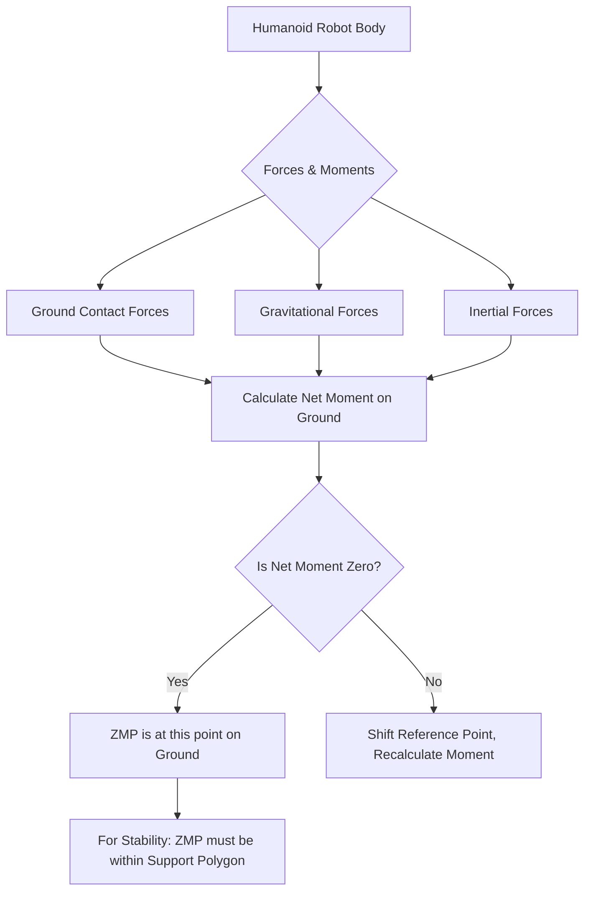

# Chapter 5: Motion Planning and Control

## Introduction

Motion planning and control are fundamental pillars in robotics, enabling robots to autonomously navigate environments, interact with objects, and perform complex tasks. Without sophisticated planning, a robot would be a static machine, unable to leverage its degrees of freedom or perceive its surroundings purposefully. Control, on the other hand, is the mechanism through which planned motions are executed, ensuring that the robot precisely follows its trajectory while maintaining stability and reacting to disturbances.

This chapter delves into the core principles and advanced techniques behind how robots decide where to go (motion planning) and how they get there (motion control). We will explore a spectrum of algorithms, from classical graph-based path planners to advanced techniques for humanoid locomotion and balance control. Understanding these concepts is crucial for any robotics engineer aiming to develop intelligent, autonomous, and robust robotic systems.

## Learning Objectives

By the end of this chapter, you will be able to:

1.  **Differentiate and apply various path planning algorithms**, including Dijkstra's, A\*, and RRT, for navigating robotic systems through complex environments.
2.  **Understand and implement Inverse Kinematics (IK)** for robotic manipulators, distinguishing between analytical and numerical solutions, and recognizing challenges like singularities and redundancy.
3.  **Explain the principles of gait generation for humanoid robots**, focusing on concepts like the Zero Moment Point (ZMP) and its role in achieving dynamic stability.
4.  **Design and analyze balance and stability control strategies** for dynamic robotic systems, particularly humanoids, using feedback control mechanisms.
5.  **Identify and discuss real-world applications and challenges** in motion planning and control across different robotic platforms.

---

## 1. Path Planning Algorithms

Path planning is the process of finding a sequence of valid configurations (a path) from a start state to a goal state, often while avoiding obstacles. The robot's configuration space (C-space) includes all possible positions and orientations of the robot. Obstacles in the physical world map to C-space obstacles, creating regions the robot cannot enter.

### 1.1. Graph-Based Search Algorithms

Graph-based search algorithms discretize the environment into a graph (e.g., a grid or a visibility graph) where nodes represent valid robot configurations and edges represent possible transitions.

#### 1.1.1. Dijkstra's Algorithm

Dijkstra's algorithm finds the shortest path between a starting node and all other nodes in a graph with non-negative edge weights. It explores the graph outwards from the start node, always choosing the unvisited node with the smallest known distance from the start.

**Characteristics:**
*   **Completeness:** Guaranteed to find the shortest path if one exists.
*   **Optimality:** Guaranteed to find the optimal (shortest) path.
*   **Efficiency:** Can be computationally expensive for large graphs as it explores all possible directions.

#### 1.1.2. A\* Search Algorithm

A\* (pronounced "A-star") is an extension of Dijkstra's algorithm that uses a heuristic function to guide its search, making it more efficient. It finds the shortest path from a start node to a goal node.

The cost function `f(n)` for a node `n` is calculated as:
`f(n) = g(n) + h(n)`
Where:
*   `g(n)`: The actual cost from the start node to `n`.
*   `h(n)`: The estimated cost (heuristic) from `n` to the goal node. An admissible heuristic never overestimates the true cost to the goal, ensuring optimality.

**Characteristics:**
*   **Completeness:** Guaranteed to find a path if one exists.
*   **Optimality:** Guaranteed to find the optimal path if the heuristic is admissible.
*   **Efficiency:** More efficient than Dijkstra's for goal-directed searches due to heuristic guidance.

**Example: A\* Pathfinding in Python (Conceptual Grid World)**

Let's consider a simple grid world where `0` represents free space, `1` represents an obstacle, and we want to find a path from start `(0,0)` to goal `(4,4)`.

```python
import heapq

def a_star_pathfinding(grid, start, goal):
    rows, cols = len(grid), len(grid[0])

    # Priority queue: (f_cost, g_cost, row, col, parent_row, parent_col)
    # f_cost = g_cost + h_cost
    open_list = []
    heapq.heappush(open_list, (0, 0, start[0], start[1], -1, -1)) # f, g, r, c, pr, pc

    # Store g_cost for visited nodes
    g_costs = {}
    g_costs[(start[0], start[1])] = 0

    # Store parent pointers to reconstruct path
    came_from = {}

    # Heuristic function (Manhattan distance)
    def heuristic(r1, c1, r2, c2):
        return abs(r1 - r2) + abs(c1 - c2)

    while open_list:
        f_cost, g_cost, r, c, pr, pc = heapq.heappop(open_list)

        if (r, c) == goal:
            path = []
            current = (r, c)
            while current != start:
                path.append(current)
                current = came_from[current]
            path.append(start)
            return path[::-1] # Reverse to get path from start to goal

        # Explore neighbors
        for dr, dc in [(0, 1), (0, -1), (1, 0), (-1, 0)]: # 4-connectivity
            nr, nc = r + dr, c + dc

            if 0 <= nr < rows and 0 <= nc < cols and grid[nr][nc] == 0:
                new_g_cost = g_cost + 1 # Cost to move to neighbor is 1

                if (nr, nc) not in g_costs or new_g_cost < g_costs[(nr, nc)]:
                    g_costs[(nr, nc)] = new_g_cost
                    h_cost = heuristic(nr, nc, goal[0], goal[1])
                    new_f_cost = new_g_cost + h_cost
                    heapq.heappush(open_list, (new_f_cost, new_g_cost, nr, nc, r, c))
                    came_from[(nr, nc)] = (r, c)

    return None # No path found

# Example Usage:
grid = [
    [0, 0, 0, 0, 0],
    [0, 1, 0, 1, 0],
    [0, 1, 0, 1, 0],
    [0, 1, 0, 0, 0],
    [0, 0, 0, 0, 0]
]
start_node = (0, 0)
goal_node = (4, 4)

path = a_star_pathfinding(grid, start_node, goal_node)
if path:
    print("Path found:", path)
    # Visualize path (optional)
    path_grid = [list(row) for row in grid]
    for r, c in path:
        if (r, c) != start_node and (r, c) != goal_node:
            path_grid[r][c] = '*'
    for row in path_grid:
        print(" ".join(map(str, row)))
else:
    print("No path found.")
```

**Explanation:** The code implements A\* search using a priority queue. `g_costs` tracks the actual cost from start, `came_from` reconstructs the path. The heuristic `heuristic` guides the search towards the goal. The output shows the sequence of coordinates for the optimal path.

#### 1.1.3. Rapidly-exploring Random Tree (RRT)

RRT is a sampling-based path planning algorithm often used in high-dimensional configuration spaces where graph-based methods become computationally intractable. It rapidly explores the space by randomly sampling points and growing a tree towards them.

**Process:**
1.  Initialize a tree `T` with the start configuration.
2.  Repeat:
    *   Generate a random configuration `q_rand` in the C-space.
    *   Find the nearest node `q_nearest` in `T` to `q_rand`.
    *   Extend `q_nearest` towards `q_rand` by a small step `epsilon` to create a new configuration `q_new`.
    *   If `q_new` is valid (collision-free), add `q_new` to `T` and an edge from `q_nearest` to `q_new`.
    *   If `q_new` is close enough to the goal, a path is found.

**Characteristics:**
*   **Probabilistic Completeness:** Guaranteed to find a path if one exists, given enough time.
*   **Non-optimality:** The basic RRT algorithm does not guarantee an optimal path. Variants like RRT\* aim for asymptotic optimality.
*   **Efficiency:** Highly effective in high-dimensional spaces and for complex obstacles.

**Diagram: RRT Algorithm Flow**

```mermaid
graph TD
    A[Start: Initialize Tree T with q_start] --> B{Loop until Goal Reached or Max Iterations};
    B --> C[Generate Random Configuration q_rand];
    C --> D[Find Nearest Node q_nearest in T to q_rand];
    D --> E[Extend q_nearest towards q_rand to q_new];
    E --> F{Is q_new valid (collision-free)?};
    F -- Yes --> G[Add q_new to T and edge from q_nearest];
    G --> H{Is q_new close to Goal?};
    H -- Yes --> I[Path Found! Terminate];
    H -- No --> B;
    F -- No --> B;
    I --> J[End];
```

*Caption: Flowchart illustrating the steps of the Rapidly-exploring Random Tree (RRT) path planning algorithm.*

**Real-World Case Study: Autonomous Navigation**
Modern autonomous vehicles, from self-driving cars to delivery robots, heavily rely on path planning algorithms. For instance, self-driving cars use a combination of global planners (often graph-based or search-based for route planning) and local planners (often sampling-based like RRT or optimization-based for immediate obstacle avoidance and trajectory generation). Recent advancements leverage deep learning for learning path planning policies in complex urban environments, combining traditional methods with neural networks to handle dynamic scenarios and uncertainties.

---

## 2. Inverse Kinematics (IK)

Kinematics deals with the motion of robots without considering the forces causing it. For robotic manipulators, there are two main problems:
*   **Forward Kinematics (FK):** Given the joint angles (or positions), determine the end-effector's pose (position and orientation) in Cartesian space. This is generally straightforward.
*   **Inverse Kinematics (IK):** Given the desired end-effector pose, determine the required joint angles (or positions) for the robot to reach that pose. This is often more challenging due to non-linearity, multiple solutions, or no solutions.

### 2.1. Analytical vs. Numerical IK Solutions

**Analytical Solutions:**
*   Involve closed-form mathematical equations to directly compute joint angles.
*   Typically available for simpler manipulators (e.g., 2-DOF, 3-DOF planar, or 6-DOF industrial robots with specific kinematic structures like spherical wrists).
*   **Advantages:** Fast, precise, provides all possible solutions.
*   **Disadvantages:** Hard to derive for complex robots, not always possible.

**Numerical Solutions:**
*   Involve iterative optimization techniques to find a solution.
*   Often used for redundant robots or those without analytical solutions.
*   Methods include Jacobian-based pseudo-inverse, gradient descent, etc.
*   **Advantages:** Applicable to any robot, handles redundancy.
*   **Disadvantages:** Slower, may get stuck in local minima, typically finds only one solution (depending on initial guess), convergence issues.

### 2.2. Jacobian and its Role in IK

The **Jacobian matrix** relates joint velocities to end-effector velocities. It is a fundamental tool for numerical IK.
`v_e = J(q) * dot(q)`
Where:
*   `v_e`: End-effector twist (linear and angular velocities).
*   `J(q)`: Jacobian matrix, dependent on joint angles `q`.
*   `dot(q)`: Joint velocities.

For IK, we are often interested in `dot(q) = J(q)^(-1) * v_e`. However, `J(q)` is usually not square or invertible. We often use its pseudo-inverse (`J#`) to find a least-squares solution for `dot(q)`.

### 2.3. Redundancy and Singularities

*   **Redundancy:** Occurs when a robot has more degrees of freedom (DoF) than required to achieve a specific task. For example, a 7-DOF arm reaching a 6-DOF pose. This allows for infinite solutions, joint limit avoidance, or obstacle avoidance.
*   **Singularities:** Robot configurations where the Jacobian matrix loses rank, meaning the end-effector loses one or more degrees of freedom. At singularities, the robot cannot move its end-effector in certain directions, and joint velocities required to achieve a desired end-effector velocity can become infinitely large.

**Diagram: 2-DOF Planar Robotic Arm Kinematic Chain**

```mermaid
graph TD
    Base -- Joint 1 (theta1) --> Link1;
    Link1 -- Joint 2 (theta2) --> Link2;
    Link2 -- End-Effector --> Target_Pose;

    subgraph Coordinate Systems
        C0[Base Frame {0}]
        C1[Joint 1 Frame {1}]
        C2[Joint 2 Frame {2}]
        CE[End-Effector Frame {E}]
    end
```

*Caption: A 2-DOF planar robotic arm showing its base, links, joints, and end-effector. This simple structure helps visualize the kinematic chain.*

**Code Example: Conceptual 2-DOF Planar Arm IK (Numerical using Pseudo-Inverse)**

This example outlines the numerical IK process for a 2-DOF planar arm. Full implementation requires a more robust kinematics library.

```python
import numpy as np

# Robot link lengths
L1 = 1.0
L2 = 1.0

def forward_kinematics(q1, q2):
    """
    Calculates the end-effector (x, y) position for a 2-DOF planar arm.
    q1, q2: joint angles in radians
    """
    x = L1 * np.cos(q1) + L2 * np.cos(q1 + q2)
    y = L1 * np.sin(q1) + L2 * np.sin(q1 + q2)
    return np.array([x, y])

def jacobian(q1, q2):
    """
    Calculates the Jacobian matrix for a 2-DOF planar arm.
    """
    J11 = -L1 * np.sin(q1) - L2 * np.sin(q1 + q2)
    J12 = -L2 * np.sin(q1 + q2)
    J21 = L1 * np.cos(q1) + L2 * np.cos(q1 + q2)
    J22 = L2 * np.cos(q1 + q2)
    return np.array([[J11, J12], [J21, J22]])

def inverse_kinematics_numerical(target_pos, initial_guess, max_iterations=100, learning_rate=0.01, tolerance=1e-3):
    """
    Numerical Inverse Kinematics using Jacobian pseudo-inverse.
    target_pos: Desired (x, y) end-effector position
    initial_guess: Initial joint angles [q1, q2]
    """
    q = np.array(initial_guess) # Current joint angles

    for i in range(max_iterations):
        current_pos = forward_kinematics(q[0], q[1])
        error = target_pos - current_pos # Positional error

        if np.linalg.norm(error) < tolerance:
            print(f"Converged in {i} iterations.")
            return q

        J = jacobian(q[0], q[1])

        # Calculate pseudo-inverse
        # DLS (Damped Least Squares) can be used to handle singularities
        try:
            J_pinv = np.linalg.pinv(J)
        except np.linalg.LinAlgError:
            print("Singularity encountered, cannot compute pseudo-inverse directly.")
            # A more robust solution would involve DLS or other singularity handling
            break

        # Update joint angles
        delta_q = learning_rate * np.dot(J_pinv, error)
        q += delta_q

    print("Max iterations reached or failed to converge.")
    return q

# Example Usage
target_x, target_y = 0.5, 1.5
initial_q = np.array([0.1, 0.1]) # radians

found_q = inverse_kinematics_numerical(np.array([target_x, target_y]), initial_q)

if found_q is not None:
    print(f"Target position: ({target_x:.2f}, {target_y:.2f})")
    print(f"Joint angles found: q1={np.degrees(found_q[0]):.2f} deg, q2={np.degrees(found_q[1]):.2f} deg")
    final_pos = forward_kinematics(found_q[0], found_q[1])
    print(f"Achieved end-effector position: ({final_pos[0]:.2f}, {final_pos[1]:.2f})")
else:
    print("IK solution not found.")
```

**Explanation:** This Python code demonstrates a numerical IK approach for a 2-DOF planar arm. It iteratively adjusts joint angles (`q`) based on the error between the current and target end-effector positions. The Jacobian pseudo-inverse (`np.linalg.pinv`) is used to calculate the necessary change in joint angles. This method is common in robotics frameworks like ROS.

**Real-World Case Study: Robotic Arm Manipulation**
In manufacturing, surgical robotics, and space exploration, inverse kinematics is critical. For example, in pick-and-place operations on assembly lines, the robot's end-effector needs to reach precise locations. Surgical robots use IK to translate surgeon's hand movements into precise tool tip motions, often in constrained environments. Advanced IK solvers are integrated into robotics frameworks such as ROS2, allowing developers to define complex tasks by specifying end-effector trajectories, and letting the framework compute the necessary joint commands.

---

## 3. Gait Generation for Humanoids

Gait generation is the process of planning the sequence of leg movements (steps) and body motions that enable a humanoid robot to walk, run, or climb while maintaining balance. Unlike wheeled or tracked robots, humanoids face the continuous challenge of dynamic stability.

### 3.1. Zero Moment Point (ZMP)

The **Zero Moment Point (ZMP)** is a crucial concept for stable bipedal locomotion. It is defined as the point on the ground where the net moment of all forces (gravitational, inertial, and contact forces) acting on the robot is zero. For a robot to maintain balance without falling, its ZMP must remain within its support polygon (the convex hull of its ground contact points).

*   **Static Walking:** ZMP is always within the support polygon. This results in slow, deliberate movements.
*   **Dynamic Walking:** ZMP can temporarily move outside the current support polygon, but its trajectory must be carefully planned to ensure stability over a sequence of steps. This allows for faster, more natural gaits.

### 3.2. Central Pattern Generators (CPGs)

**Central Pattern Generators (CPGs)** are biological neural circuits that can produce rhythmic outputs without rhythmic input. In robotics, CPGs are often used as a bio-inspired approach to generate rhythmic limb movements for locomotion. They can simplify gait generation by reducing the need for explicit trajectory planning for every joint, allowing for more adaptive and robust gaits.

**Diagram: Zero Moment Point (ZMP) Concept**



*Caption: Conceptual diagram explaining the Zero Moment Point (ZMP) and its relationship to stability in bipedal locomotion.*

**Code Example: Conceptual ZMP Calculation (Pseudocode/Simplified Python)**

A full ZMP controller involves complex dynamics. Here's a simplified conceptual illustration of how the ZMP is related to the center of mass (CoM).

```python
import numpy as np

def calculate_zmp_1d(com_pos, com_vel, com_acc, gravity=9.81, height=0.5):
    """
    Simplified 1D ZMP calculation for a cart-table model (linear inverted pendulum).
    Assumes a constant CoM height for simplicity.

    com_pos: current Center of Mass position (x)
    com_vel: current Center of Mass velocity (vx)
    com_acc: current Center of Mass acceleration (ax)
    gravity: acceleration due to gravity
    height: constant height of the Center of Mass from the ground
    """
    # This is a highly simplified model. Real ZMP calculation is more complex
    # and involves moments about the contact points.

    # For a linear inverted pendulum model, ZMP_x = CoM_x - (CoM_z / g) * CoM_acc_x
    # Where CoM_z is the height, g is gravity.

    # In a simplified sense, if the robot is accelerating, the ZMP shifts
    # opposite to the acceleration to maintain balance.

    # For dynamic walking, ZMP must be planned to stay within the support polygon
    # over time, even if instantaneous ZMP is outside.

    # This formula is often used for simplified models like the Linear Inverted Pendulum Model (LIPM)
    zmp_x = com_pos - (height / gravity) * com_acc

    return zmp_x

# Example Usage:
# Assume a robot with CoM at x=0.1m, moving with some acceleration
com_position_x = 0.1 # meters
com_velocity_x = 0.05 # m/s
com_acceleration_x = 0.2 # m/s^2 (e.g., trying to accelerate forward)
com_height = 0.8 # meters (typical humanoid CoM height)

zmp_x_calculated = calculate_zmp_1d(com_position_x, com_velocity_x, com_acceleration_x, height=com_height)

print(f"Calculated 1D ZMP position: {zmp_x_calculated:.3f} m")

# In a real scenario, this ZMP would be compared against the support polygon
# of the robot's feet on the ground to assess stability.
# If zmp_x is outside the support polygon, the robot is likely to fall.
# Controllers then adjust joint torques/angles to bring the ZMP back into stability.
```

**Explanation:** This Python snippet provides a highly simplified 1D calculation of the ZMP based on a linear inverted pendulum model. In real humanoid robotics, ZMP calculation involves the full dynamics of the robot and all external forces. However, this example illustrates the core idea: ZMP location depends on the Center of Mass (CoM) position and its acceleration relative to gravity and CoM height.

**Real-World Case Study: Atlas Robot Locomotion**
Boston Dynamics' Atlas robot is a prime example of advanced gait generation. Atlas uses sophisticated model predictive control (MPC) and whole-body control techniques that inherently manage the ZMP and Center of Mass (CoM) trajectories. Its dynamic gaits, including running, jumping, and navigating uneven terrain, demonstrate how careful planning of ZMP and CoM, combined with powerful actuation and robust control, enables highly agile humanoid locomotion.

---

## 4. Balance and Stability Control

Maintaining balance and stability is paramount for dynamic robots, especially humanoids and aerial manipulators. This involves continuously sensing the robot's state and applying corrective actions to prevent falling or unwanted deviations.

### 4.1. Feedback Control for Balance (PID Controllers)

**Feedback control** is essential for balance. Sensors (IMUs, force-torque sensors, encoders) provide real-time information about the robot's orientation, joint positions, and contact forces. This information is fed back to a controller which calculates the necessary corrective torques or forces.

**PID (Proportional-Integral-Derivative) controllers** are commonly used in various levels of robotics control, including balance.
*   **Proportional (P):** Reacts to the current error. Larger error means larger corrective action.
*   **Integral (I):** Accounts for past errors, helping to eliminate steady-state errors.
*   **Derivative (D):** Predicts future errors based on the rate of change of error, adding damping to prevent overshoot and oscillations.

### 4.2. Whole-Body Control (WBC)

**Whole-Body Control (WBC)** is an advanced control framework that coordinates all the robot's degrees of freedom (joints) simultaneously to achieve multiple objectives (e.g., maintain balance, reach a target, avoid joint limits, minimize energy) in a prioritized or weighted manner. It typically formulations the control problem as an optimization problem, solving for joint torques or accelerations that satisfy all desired tasks.

### 4.3. Disturbance Rejection

Robots operating in unstructured environments frequently encounter disturbances (e.g., pushes, uneven ground, unexpected loads). **Disturbance rejection** is the ability of a control system to counteract these external forces and maintain its desired state or trajectory. Robust control techniques, high-gain feedback, and adaptive control strategies are employed to enhance disturbance rejection capabilities.

**Diagram: Basic Feedback Control Loop for Balance**

```mermaid
graph TD
    A[Desired Robot State (e.g., Upright Pose)] --> B[Error Calculation];
    B --> C[Controller (e.g., PID, WBC)];
    C --> D[Robot Actuators (Motors)];
    D --> E[Robot Dynamics];
    E --> F[Robot Sensors (IMU, Encoders, F/T)];
    F --> B;
    F --> G[Actual Robot State];
    G --> B;
```

*Caption: A basic feedback control loop for maintaining robot balance. The controller continuously adjusts actuator commands based on the error between the desired and actual robot states.*

**Code Example: Conceptual PID Controller for an Inverted Pendulum**

This is a simplified 1D PID controller for balancing an inverted pendulum. In a real robot, this would be significantly more complex, involving multiple joints and sensors.

```python
import numpy as np
import matplotlib.pyplot as plt

class PIDController:
    def __init__(self, kp, ki, kd, dt):
        self.kp = kp
        self.ki = ki
        self.kd = kd
        self.dt = dt # Time step

        self.previous_error = 0
        self.integral = 0

    def compute(self, setpoint, current_value):
        error = setpoint - current_value

        self.integral += error * self.dt
        derivative = (error - self.previous_error) / self.dt

        output = self.kp * error + self.ki * self.integral + self.kd * derivative

        self.previous_error = error
        return output

# Simulate an inverted pendulum (very simplified dynamics)
def pendulum_dynamics(angle, angular_velocity, torque, dt):
    # m*l^2 * theta_ddot = m*g*l*sin(theta) + torque
    # For simplicity, let's assume m*l^2 = 1, m*g*l = 1
    angular_acceleration = np.sin(angle) + torque # plus external disturbances if any

    angular_velocity += angular_acceleration * dt
    angle += angular_velocity * dt

    return angle, angular_velocity

# Simulation parameters
dt = 0.01 # seconds
total_time = 5 # seconds
time_points = np.arange(0, total_time, dt)

# PID gains (tuned for stability, these are illustrative)
kp = 10.0
ki = 0.1
kd = 5.0

pid = PIDController(kp, ki, kd, dt)

# Initial state of the pendulum (slightly tilted)
current_angle = 0.1 # radians (relative to upright, 0 is upright)
current_angular_velocity = 0.0 # rad/s
setpoint_angle = 0.0 # Desire upright position

angle_history = []
velocity_history = []
torque_history = []

for t in time_points:
    torque = pid.compute(setpoint_angle, current_angle)

    current_angle, current_angular_velocity = pendulum_dynamics(current_angle, current_angular_velocity, torque, dt)

    angle_history.append(current_angle)
    velocity_history.append(current_angular_velocity)
    torque_history.append(torque)

# Plotting the results
plt.figure(figsize=(12, 6))
plt.subplot(3, 1, 1)
plt.plot(time_points, angle_history, label='Angle (rad)')
plt.axhline(y=setpoint_angle, color='r', linestyle='--', label='Setpoint')
plt.ylabel('Angle')
plt.title('Inverted Pendulum Balance Control')
plt.legend()
plt.grid(True)

plt.subplot(3, 1, 2)
plt.plot(time_points, velocity_history, label='Angular Velocity (rad/s)')
plt.ylabel('Angular Velocity')
plt.legend()
plt.grid(True)

plt.subplot(3, 1, 3)
plt.plot(time_points, torque_history, label='Control Torque')
plt.ylabel('Torque')
plt.xlabel('Time (s)')
plt.legend()
plt.grid(True)

plt.tight_layout()
plt.show()
```

**Explanation:** This Python code simulates a simplified inverted pendulum balanced by a PID controller. The `PIDController` class calculates the required `torque` based on the error between the current angle and the `setpoint_angle` (upright). The `pendulum_dynamics` function updates the pendulum's state. The plots show how the angle converges to the setpoint, demonstrating basic balance control.

**Real-World Case Study: Humanoid Robot Disturbance Recovery**
Humanoid robots, like those from Agility Robotics (Digit) or Boston Dynamics (Atlas), continuously employ sophisticated balance control. When pushed or navigating uneven terrain, their control systems detect the disturbance via IMUs and force-torque sensors. Whole-body controllers then rapidly calculate and apply corrective joint torques to shift the robot's center of mass, adjust foot placement, and re-establish stability. This rapid, coordinated action across all joints is crucial for graceful and robust human-like interaction with dynamic environments.

---

## Exercises

1.  **Conceptual Question: Path Planning Comparison**
    *   You are tasked with designing a navigation system for an autonomous warehouse robot. The warehouse map is known and static, but the robot needs to find the shortest path between pickup and delivery locations.
        *   Would you prefer Dijkstra's, A\*, or RRT for this scenario? Justify your choice by discussing the strengths and weaknesses of each algorithm in this context.
        *   How would your choice change if the warehouse environment was highly dynamic with moving obstacles and unknown elements?

2.  **Coding Challenge: Dijkstra's on a Grid**
    *   Implement Dijkstra's algorithm to find the shortest path in a 2D grid with obstacles. Assume movement is restricted to 4 directions (up, down, left, right). Each step has a cost of 1.
    *   The grid should be represented as a 2D list or NumPy array, where `0` is free space and `1` is an obstacle.
    *   Test your implementation with a start point `(0,0)` and a goal point `(rows-1, cols-1)` on a `5x5` grid with a few obstacles. Print the path.

3.  **Design Problem: Redundant Arm IK**
    *   Consider a 7-DOF robotic arm used for painting complex surfaces. The painting task requires precise end-effector positioning and orientation (6-DOF task). Since the arm is redundant, propose at least two ways the extra degree of freedom could be utilized during the IK solution to improve performance or achieve secondary objectives. For example, consider obstacle avoidance, joint limit avoidance, or singularity avoidance.

4.  **Application Scenario: Humanoid Walking**
    *   A research team is developing a new humanoid robot designed for disaster relief, which needs to walk over rubble and uneven terrain.
        *   Explain why the Zero Moment Point (ZMP) concept is critical for ensuring the robot's stability in such a challenging environment.
        *   Discuss at least two control strategies or concepts, beyond basic ZMP tracking, that the team might need to incorporate into their gait generator to enhance robust locomotion on highly uneven ground.

---

## References

1.  **General Robotics & Motion Planning:**
    *   Choset, H., Lynch, K. M., Hutchinson, S., Kantor, G., Burgard, W., Kavraki, L. E., & Thrun, S. (2005). *Principles of Robot Motion: Theory, Algorithms, and Implementations*. MIT Press. (Classic textbook on motion planning).
    *   LaValle, S. M. (2006). *Planning Algorithms*. Cambridge University Press. (Comprehensive resource on planning).

2.  **Inverse Kinematics:**
    *   Siciliano, B., Sciavicco, L., Villani, L., & Oriolo, G. (2009). *Robotics: Modelling, Planning and Control*. Springer. (Standard textbook covering kinematics and control).
    *   ROS Kinematics Tutorials: [https://wiki.ros.org/kinematics](https://wiki.ros.org/kinematics) (For practical ROS-based IK implementations and concepts).

3.  **Gait Generation & Humanoid Robotics:**
    *   Kajita, S., Kanehiro, F., Kaneko, K., Fujiwara, K., Harada, K., Morisawa, M., & Miura, K. (2003). *Biped Robot ZMP Compensation for Any Walking Pattern*. IEEE/RSJ International Conference on Intelligent Robots and Systems (IROS). (Foundational work on ZMP).
    *   Pons, J. L. (2008). *Wearable Robots: Biomechatronic Exoskeletons*. John Wiley & Sons. (Relevant for understanding human-like locomotion mechanisms).
    *   Research on Boston Dynamics Atlas: Recent papers and conference presentations at ICRA/IROS (e.g., *Dynamic and Robust Multipedal Locomotion on Challenging Terrain with Atlas* - 2024/2025 relevant works often found on their research page or in top robotics conferences).

4.  **Balance and Stability Control:**
    *   Slavova, S. (2015). *Control of Robotic Systems: PID and Optimal Control*. CRC Press. (Covers PID and other control methods).
    *   Herzog, N. A., Schindlauer, B., & Remy, C. D. (2014). *Whole-Body Control of a Humanoid Robot: An Optimization-Based Approach*. IEEE/RSJ International Conference on Intelligent Robots and Systems (IROS). (Illustrates WBC application).
    *   Videos and publications from Agility Robotics on Digit: [https://www.agilityrobotics.com/research](https://www.agilityrobotics.com/research) (Showcasing real-world balance and disturbance rejection).

---