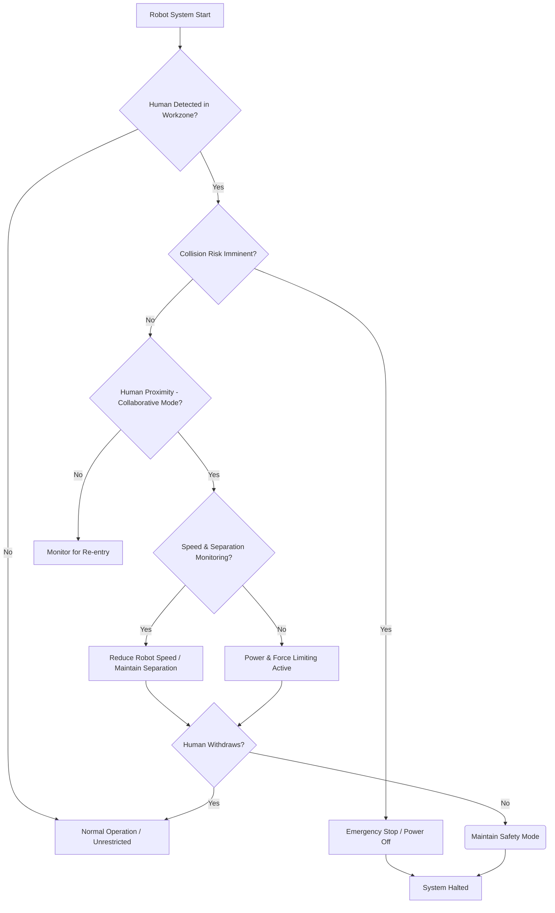

# Chapter 7: Human-Robot Interaction - Bridging the Gap

## Introduction
Human-Robot Interaction (HRI) is a rapidly evolving field dedicated to understanding, designing, and evaluating robotic systems for use by or with humans. As robots transition from isolated industrial cages to collaborative workspaces, homes, and public environments, effective and intuitive interaction becomes paramount. This chapter delves into the core aspects of HRI, exploring natural language interfaces, gesture and speech recognition, critical safety considerations, and the profound ethical implications that arise from increasingly sophisticated human-robot collaboration. For university-level students, a deep dive into these topics is essential to developing the next generation of intelligent and socially aware robotic systems.

## Learning Objectives
Upon completing this chapter, readers will be able to:
1.  Explain the fundamental principles and various modalities of Human-Robot Interaction.
2.  Design and implement basic natural language and gesture/speech recognition interfaces for robotic systems using Python and ROS2.
3.  Identify and analyze key safety standards and considerations for collaborative human-robot environments.
4.  Critically evaluate the ethical implications of HRI, including issues of privacy, autonomy, and social impact.
5.  Discuss real-world case studies demonstrating both the successes and challenges in modern HRI applications.

## 1. Foundations of Human-Robot Interaction (HRI)

### Definition and Importance
Human-Robot Interaction (HRI) is an interdisciplinary field that studies the relationships between humans and robots. Its primary goal is to enable seamless, efficient, and natural communication and collaboration. As robots become more ubiquitous in our daily lives, from industrial automation to personal assistance, the quality of HRI directly impacts their acceptance, usability, and effectiveness. A poorly designed HRI can lead to frustration, errors, and even danger.

The importance of HRI stems from several factors:
*   **Increased Robot Autonomy:** As robots gain more decision-making capabilities, understanding their intent and being able to guide them becomes crucial.
*   **Collaborative Workspaces:** Robots are moving out of cages and into shared spaces with humans (cobots), requiring intuitive and safe interaction methods.
*   **Social Integration:** Service robots, companion robots, and robots in public spaces necessitate interaction that aligns with human social norms.
*   **User Experience (UX):** Like any technology, robots must be user-friendly to maximize their potential and ensure positive adoption.

### HRI Modalities
HRI encompasses various communication modalities, each with its strengths and challenges:
*   **Verbal Communication:** Speech recognition and natural language understanding (NLU).
*   **Non-Verbal Communication:** Gestures, facial expressions, body language, gaze.
*   **Physical Interaction:** Haptic feedback, shared control, physical guidance.
*   **Graphical User Interfaces (GUIs):** Touchscreens, augmented reality, projection.
*   **Environmental Cues:** Lights, sounds, vibrations.

This chapter will primarily focus on verbal and non-verbal communication methods, particularly natural language interfaces and gesture/speech recognition.

## 2. Natural Language Interfaces

Natural Language Interfaces (NLIs) allow humans to communicate with robots using everyday language, eliminating the need for complex programming or rigid command structures. This mimics human-to-human interaction, making robots more accessible and intuitive to a broader range of users.

### Overview and Challenges
The core idea behind NLIs is to bridge the gap between human language and robot actions. This involves several complex stages:
1.  **Speech-to-Text (STT):** Converting spoken words into text (if verbal input).
2.  **Natural Language Understanding (NLU):** Parsing the text to extract intent, entities, and context.
3.  **Task Planning:** Translating the understood intent into a sequence of robot actions.
4.  **Response Generation:** Providing feedback to the user, often in natural language.

**Challenges:**
*   **Ambiguity:** Natural language is inherently ambiguous (e.g., "pick up the block" – which block? where?).
*   **Context Sensitivity:** Understanding commands often requires rich contextual information about the environment, robot state, and user's goal.
*   **Robustness:** NLIs must be resilient to variations in speech, accents, grammar, and vocabulary.
*   **Domain Specificity:** General language models may struggle with specific robotics terminology or tasks.
*   **Grounding:** Connecting abstract linguistic concepts (e.g., "left," "big") to physical perceptions and actions in the robot's environment.

### Semantic Parsing and Understanding
Semantic parsing is the process of transforming natural language utterances into formal meaning representations that robots can act upon. This often involves techniques like:
*   **Rule-based systems:** Predefined grammatical rules and patterns.
*   **Statistical models:** Machine learning approaches trained on large datasets (e.g., Hidden Markov Models, Conditional Random Fields).
*   **Neural networks:** Deep learning models, especially Transformer-based architectures, have revolutionized NLU by learning complex linguistic patterns and context (e.g., BERT, GPT). These models can extract intent (e.g., "move_object") and entities (e.g., `object: "red_block"`, `destination: "table_A"`).

### Real-world Case Studies
*   **Industrial Robotics:** Advanced manufacturing facilities are integrating NLIs to allow operators to instruct robots more flexibly, reducing reprogramming downtime. For example, commanding a robot to "move gripper to position A" or "pick up the component from the feeder."
*   **Service Robotics:** Home assistant robots or hospital robots use NLIs for tasks like "bring me water" or "navigate to the kitchen." Projects like the [HRI-ROS project](https://www.hri-ros.com/) demonstrate frameworks for such interactions.
*   **Autonomous Driving:** While not direct robot interaction, the NLI principles are applied in voice command systems for navigation and infotainment.

### Python/ROS2 Code Example: Simple Natural Language Command Parsing

This example demonstrates a rudimentary natural language command parser in Python, conceptually integrated with ROS2. It identifies simple commands like "move" and "pick" and extracts associated objects and locations. In a real ROS2 system, these commands would be published as messages to a robot control node.

```python
# D:\Abdul Kabir\agentic_ai\hackathon\panaversity-robotics-hackathon\book\docs\hri_nlp_example.py

import rclpy
from rclpy.node import Node
from std_msgs.msg import String # For publishing simple commands
import re

class NLPRobotCommander(Node):
    def __init__(self):
        super().__init__('nlp_robot_commander')
        self.publisher_ = self.create_publisher(String, 'robot_command', 10)
        self.get_logger().info('NLP Robot Commander node started.')

    def parse_and_command(self, natural_language_input: str):
        self.get_logger().info(f"Received command: '{natural_language_input}'")
        command = None
        target_object = None
        location = None

        # Define keywords for actions
        move_keywords = ["move", "go", "navigate"]
        pick_keywords = ["pick up", "grasp", "take"]

        # Simple pattern matching for intent and entities
        if any(keyword in natural_language_input.lower() for keyword in move_keywords):
            command = "move"
            match = re.search(r'(to|at|towards)\s+(the\s+)?(\w+)', natural_language_input.lower())
            if match:
                location = match.group(3)
        elif any(keyword in natural_language_input.lower() for keyword in pick_keywords):
            command = "pick"
            match = re.search(r'(pick up|grasp|take)\s+(the\s+)?(\w+)', natural_language_input.lower())
            if match:
                target_object = match.group(3)

        if command:
            robot_command_msg = String()
            if command == "move":
                robot_command_msg.data = f"COMMAND:MOVE LOCATION:{location if location else 'UNKNOWN'}"
            elif command == "pick":
                robot_command_msg.data = f"COMMAND:PICK OBJECT:{target_object if target_object else 'UNKNOWN'}"

            self.publisher_.publish(robot_command_msg)
            self.get_logger().info(f"Published robot command: '{robot_command_msg.data}'")
        else:
            self.get_logger().warn("Could not parse command.")

def main(args=None):
    rclpy.init(args=args)
    nlp_commander = NLPRobotCommander()

    # Simulate receiving natural language input
    nlp_commander.parse_and_command("Please move the robot to the charging station.")
    nlp_commander.parse_and_command("Pick up the red block.")
    nlp_commander.parse_and_command("Go to the kitchen.")
    nlp_commander.parse_and_command("What time is it?") # Unparseable command

    rclpy.spin_once(nlp_commander, timeout_sec=1.0) # Process published messages
    nlp_commander.destroy_node()
    rclpy.shutdown()

if __name__ == '__main__':
    main()
```
**Explanation:**
This Python script, using ROS2's `rclpy`, sets up a simple node that simulates receiving natural language commands. It uses regular expressions to identify keywords for "move" and "pick" actions and extracts potential targets (locations or objects). A `std_msgs/String` message containing a simplified command format is then published to the `robot_command` topic. A real robotic system would subscribe to this topic and execute the corresponding actions. This example highlights the fundamental steps of converting human language into structured robot commands, even with basic NLU.

## 3. Gesture and Speech Recognition

Beyond explicit language, robots can infer intent from human gestures, facial expressions, and prosodic features of speech. This multimodal interaction makes HRI more natural and efficient.

### Gesture Recognition: Techniques and Applications
Gesture recognition involves interpreting human body movements as commands or communicative signals.
**Techniques:**
*   **Vision-based:** Using cameras to track body parts, hand poses, or full-body gestures. Techniques include:
    *   **Feature extraction:** Identifying key points (e.g., hand landmarks using MediaPipe, OpenPose).
    *   **Machine learning:** Classifying gesture patterns using SVMs, HMMs, or deep learning models (CNNs, LSTMs for temporal sequences).
*   **Sensor-based:** Using wearable sensors (e.g., accelerometers, gyroscopes, flex sensors) to detect specific movements.
*   **Depth sensing:** Utilizing depth cameras (e.g., Intel RealSense, Azure Kinect) to get 3D pose information, making it robust to lighting changes.

**Applications:**
*   **Teleoperation:** Controlling robots remotely with intuitive hand gestures.
*   **Collaborative Robotics:** Directing a cobot's path or signaling task completion with a nod.
*   **Sign Language Interpretation:** Assisting communication for hearing-impaired individuals.
*   **Medical Robotics:** Surgeons controlling instruments with subtle hand gestures.

### Speech Recognition: ASR, NLU in Robotics
Speech recognition, also known as Automatic Speech Recognition (ASR), converts spoken language into text. In robotics, ASR is often coupled with NLU to fully understand the user's intent.

**ASR Systems:**
*   **Acoustic Model:** Maps audio signals to phonemes or sub-word units.
*   **Pronunciation Model (Lexicon):** Maps phonemes to words.
*   **Language Model:** Predicts the probability of word sequences, aiding in disambiguation.

Modern ASR systems extensively use deep learning (e.g., recurrent neural networks, Transformer networks) for enhanced accuracy and robustness.

**Challenges in Robotics:**
*   **Noise:** Robotic environments are often noisy, degrading ASR performance.
*   **Far-field Speech:** Humans might speak to robots from a distance, requiring robust microphone arrays and beamforming techniques.
*   **Emotion and Intonation:** Understanding the emotional state or emphasis in speech can provide crucial context.

### Integration with Robotic Systems
Integrating gesture and speech recognition involves a pipeline:
1.  **Sensor Input:** Microphones for speech, cameras/depth sensors for gestures.
2.  **Preprocessing:** Noise reduction, feature extraction.
3.  **Recognition:** ASR and gesture classification.
4.  **Fusion:** Combining information from multiple modalities to resolve ambiguities or reinforce commands (e.g., saying "stop" while raising a hand).
5.  **NLU/Action Mapping:** Translating recognized intents into robot actions.

### Python/ROS2 Code Example: Basic Gesture Command (Conceptual)

This conceptual Python/ROS2 example simulates a simple gesture recognition system. It imagines receiving gesture data (e.g., "wave," "point_left") from a sensor and translates it into a robot command. In a real system, `gesture_input` would come from a vision processing pipeline.

```python
# D:\Abdul Kabir\agentic_ai\hackathon\panaversity-robotics-hackathon\book\docs\hri_gesture_example.py

import rclpy
from rclpy.node import Node
from std_msgs.msg import String # For publishing simple commands

class GestureRobotCommander(Node):
    def __init__(self):
        super().__init__('gesture_robot_commander')
        self.publisher_ = self.create_publisher(String, 'robot_gesture_command', 10)
        self.get_logger().info('Gesture Robot Commander node started.')
        self.gesture_mapping = {
            "wave": "COMMAND:STOP",
            "point_left": "COMMAND:MOVE_LEFT",
            "point_right": "COMMAND:MOVE_RIGHT",
            "thumbs_up": "COMMAND:ACKNOWLEDGE"
        }

    def process_gesture(self, gesture_input: str):
        self.get_logger().info(f"Received gesture: '{gesture_input}'")

        command = self.gesture_mapping.get(gesture_input.lower())

        if command:
            robot_command_msg = String()
            robot_command_msg.data = command
            self.publisher_.publish(robot_command_msg)
            self.get_logger().info(f"Published robot gesture command: '{robot_command_msg.data}'")
        else:
            self.get_logger().warn(f"Unknown gesture: '{gesture_input}'")

def main(args=None):
    rclpy.init(args=args)
    gesture_commander = GestureRobotCommander()

    # Simulate receiving gesture input
    gesture_commander.process_gesture("wave")
    gesture_commander.process_gesture("point_left")
    gesture_commander.process_gesture("unknown_gesture")

    rclpy.spin_once(gesture_commander, timeout_sec=1.0)
    gesture_commander.destroy_node()
    rclpy.shutdown()

if __name__ == '__main__':
    main()
```
**Explanation:**
Similar to the NLP example, this ROS2 Python node simulates processing gesture inputs. It uses a dictionary to map recognized gesture strings (e.g., from a vision system) to predefined robot commands. These commands are then published as `String` messages on the `robot_gesture_command` topic. This illustrates how high-level gesture interpretations can be interfaced with a robot's control system.

### Python/ROS2 Code Example: Basic Speech Command (Conceptual)

This example combines a conceptual speech recognition output with ROS2 to demonstrate command processing.

```python
# D:\Abdul Kabir\agentic_ai\hackathon\panaversity-robotics-hackathon\book\docs\hri_speech_example.py

import rclpy
from rclpy.node import Node
from std_msgs.msg import String # For publishing simple commands
import re

class SpeechRobotCommander(Node):
    def __init__(self):
        super().__init__('speech_robot_commander')
        self.publisher_ = self.create_publisher(String, 'robot_speech_command', 10)
        self.get_logger().info('Speech Robot Commander node started.')
        self.command_phrases = {
            "stop": "COMMAND:HALT",
            "go forward": "COMMAND:MOVE_FORWARD",
            "turn left": "COMMAND:TURN_LEFT",
            "hello robot": "COMMAND:GREET"
        }

    def process_speech_text(self, speech_text: str):
        self.get_logger().info(f"Received speech text: '{speech_text}'")

        # Simple matching for predefined command phrases
        command = None
        for phrase, robot_cmd in self.command_phrases.items():
            if phrase in speech_text.lower():
                command = robot_cmd
                break

        if command:
            robot_command_msg = String()
            robot_command_msg.data = command
            self.publisher_.publish(robot_command_msg)
            self.get_logger().info(f"Published robot speech command: '{robot_command_msg.data}'")
        else:
            self.get_logger().warn(f"Could not understand speech command: '{speech_text}'")

def main(args=None):
    rclpy.init(args=args)
    speech_commander = SpeechRobotCommander()

    # Simulate ASR output
    speech_commander.process_speech_text("Robot, please stop now.")
    speech_commander.process_speech_text("Can you go forward a bit?")
    speech_commander.process_speech_text("What's the weather like?") # Ununderstood command

    rclpy.spin_once(speech_commander, timeout_sec=1.0)
    speech_commander.destroy_node()
    rclpy.shutdown()

if __name__ == '__main__':
    main()
```
**Explanation:**
This ROS2 Python node simulates the output of an ASR system (raw text). It then attempts to match the received text against a list of predefined command phrases. If a match is found, a corresponding robot command is published as a `String` message on the `robot_speech_command` topic. This demonstrates the post-ASR processing step to extract actionable commands.

## 4. Safety Considerations in HRI

Safety is paramount in any environment where humans and robots interact. The shift from isolated industrial robots to collaborative robots (cobots) necessitates rigorous safety standards and methodologies.

### Physical Safety (e.g., ISO/TS 15066)
Physical safety in HRI primarily focuses on preventing injuries to humans from physical contact with robots. This is particularly critical in collaborative workspaces.
*   **ISO/TS 15066: Collaborative Robot Operation:** This technical specification (not a full standard yet, but widely adopted) outlines safety requirements for collaborative robot systems. It defines four types of collaborative operations:
    1.  **Safety-rated monitored stop:** The robot stops before a human enters its collaborative workspace.
    2.  **Hand guiding:** The human guides the robot by direct physical contact.
    3.  **Speed and separation monitoring:** The robot's speed is reduced when a human is detected nearby, maintaining a safe distance.
    4.  **Power and force limiting:** The robot's power and force are inherently limited, or contacts are designed to be transient and non-injurious.
*   **Risk Assessment:** A thorough risk assessment is essential to identify potential hazards and implement protective measures (e.g., safety sensors, protective stops, speed limits).
*   **Ergonomics:** Designing robot workspaces and interaction points to minimize strain or awkward postures for human operators.

### Functional Safety
Functional safety refers to the ability of a system to perform its intended safety functions correctly under specified conditions. In HRI, this means ensuring that safety-related control systems (e.g., emergency stops, collision detection) work reliably.
*   **Safety-related Control System (SRCS):** These systems are responsible for bringing the robot to a safe state in case of a fault or hazardous event.
*   **Performance Level (PL) and Safety Integrity Level (SIL):** Standards like ISO 13849 (PL) and IEC 62061 (SIL) specify requirements for the design and validation of SRCS, ensuring they meet a certain level of reliability and fault tolerance.
*   **Redundancy and Diversity:** Implementing redundant safety components and diverse sensing modalities (e.g., multiple cameras, lidar, force sensors) enhances reliability.

### Human-in-the-Loop Control
In many advanced HRI scenarios, humans remain "in the loop," providing supervisory control, making critical decisions, or intervening when necessary.
*   **Levels of Automation:** Understanding the different levels of automation (from full manual control to full autonomy) helps define the human's role and responsibility.
*   **Situation Awareness:** Designing interfaces that provide humans with clear and timely information about the robot's state, intentions, and environment.
*   **Trust and Transparency:** Building trust in robot autonomy through transparent decision-making processes and predictable behavior.

### Mermaid Diagram: Safety System Flow

This diagram illustrates a simplified safety system flow for a collaborative robot, demonstrating decision points for different interaction modes.


**Explanation:** This flow diagram outlines the decision-making process for a collaborative robot's safety system. It begins with detecting a human and branches based on collision risk and proximity, leading to various safety responses such as emergency stops, speed reduction, or power/force limiting, ultimately aiming to ensure human safety.

## 5. Ethical Implications of HRI

As robots become more integrated into society, a complex array of ethical considerations arises, demanding careful thought from engineers, ethicists, and policymakers.

### Privacy and Data Security
*   **Sensor Data:** Robots equipped with cameras, microphones, and other sensors collect vast amounts of data about their environment and the humans within it. This raises concerns about who owns this data, how it's stored, and who has access to it.
*   **Personal Identification:** Can robots identify individuals? How is biometric data (e.g., facial recognition, voice prints) handled?
*   **Behavioral Data:** Robots can observe and record human behavior, potentially leading to profiling or surveillance without consent.
*   **Mitigation:** Implementing privacy-by-design principles, strong encryption, anonymization techniques, clear data retention policies, and transparent communication with users.

### Autonomy and Accountability
*   **Shared Control:** In collaborative tasks, who is responsible when an error occurs – the human operator, the robot, or the designer/manufacturer?
*   **Moral Agency:** As robots gain more autonomy, do they possess any form of moral agency? How should we attribute responsibility for their actions, especially in unforeseen circumstances?
*   **Decision-Making Transparency:** Autonomous robots must be able to explain their decisions, especially in critical situations, to foster trust and allow for accountability.
*   **Ethical AI Frameworks:** Developing and adhering to ethical AI principles (e.g., fairness, non-maleficence, beneficence) to guide the design of autonomous HRI systems.

### Bias and Discrimination
*   **Algorithmic Bias:** If HRI systems are trained on biased data (e.g., limited representation of certain demographics in speech or gesture datasets), they can perpetuate and amplify existing societal biases. This can lead to unequal or unfair treatment.
*   **Fairness in Interaction:** Ensuring that robots interact equitably with all users, regardless of gender, race, age, or disability.
*   **Mitigation:** Diverse and representative training datasets, rigorous bias testing, transparent algorithm design, and continuous monitoring.

### Social and Psychological Impact
*   **Job Displacement:** The widespread adoption of robots, particularly in collaborative settings, raises concerns about job displacement and the need for retraining and reskilling human workers.
*   **Emotional Attachment and Deception:** Companion robots or care robots can elicit strong emotional responses from humans. Designers must consider the ethics of fostering emotional attachment and avoid deceptive designs that pretend to have emotions or consciousness.
*   **Social Isolation:** Over-reliance on robot companions could potentially lead to decreased human-to-human interaction.
*   **Impact on Human Skills:** Will extensive HRI lead to a degradation of human skills in certain areas?

### Case Studies/Discussions
*   **Care Robots for the Elderly:** While offering companionship and assistance, questions arise about the quality of care, privacy, and the potential for emotional manipulation or neglect of human interaction.
*   **Military Robotics:** The use of autonomous weapon systems (LAWS) raises profound ethical questions about the delegation of lethal decision-making to machines, accountability, and the dehumanization of warfare.
*   **Robots in Education:** How should robots be used as educational tools? What are the implications for student development and human teacher roles?

## Conclusion

Human-Robot Interaction is a dynamic and critical field that sits at the intersection of robotics, AI, psychology, and ethics. As robots increasingly become our colleagues, companions, and assistants, the ability to communicate with them naturally, safely, and ethically will define their ultimate success and societal impact. From the intricacies of natural language understanding and multimodal gesture/speech recognition to the fundamental requirements of physical safety and the profound ethical dilemmas of autonomy and privacy, HRI demands an interdisciplinary approach. By thoughtfully designing interactions, adhering to robust safety standards, and proactively addressing ethical challenges, we can unlock the full potential of robotics for the betterment of humanity.

## Exercises

1.  **Conceptual Question: Multimodal HRI (Beginner/Intermediate)**
    Consider a domestic robot designed to help with household chores. Describe three different scenarios where a combination of natural language, gesture, and speech recognition would significantly improve the robot's usability and efficiency compared to using only one modality. Explain *why* multimodal interaction is beneficial in each scenario.

2.  **Coding Challenge: Extending NLP (Intermediate)**
    Enhance the `NLPRobotCommander` example provided in Section 2.
    *   Add support for a new command: "report_status". When this command is detected, the robot should conceptually "report" its battery level (e.g., "My battery is 75%").
    *   Modify the "move" command to accept more complex locations, such as "move to the red chair" or "go to the living room table." You'll need to update the regex or parsing logic.
    *   (Optional, Advanced) Integrate a simple sentiment analysis to detect if the user's command is urgent (e.g., "Robot, *quickly* move to the door!"). If urgent, the robot could conceptually prioritize the task.

3.  **Design Problem: Collaborative Robot Safety (Intermediate/Advanced)**
    Imagine you are designing a collaborative robot that works alongside human workers in an electronics assembly plant. This robot needs to hand over components to human workers.
    *   Describe the specific safety features and sensors you would incorporate into the robot and its workspace to comply with ISO/TS 15066 (specifically "Speed and Separation Monitoring" and "Power and Force Limiting").
    *   Outline a basic safety protocol for when a human enters the robot's collaborative workspace.
    *   Draw a simple Mermaid state diagram illustrating the robot's operational states (e.g., "Idle," "Collaborative Mode," "Safety Stop") and the transitions between them based on human presence and commands.

4.  **Ethical Discussion: Autonomous Decision-Making (Advanced)**
    A future autonomous delivery robot encounters a situation where it must choose between two undesirable outcomes:
    *   **Option A:** Swerve rapidly, potentially damaging sensitive cargo, but avoiding a minor collision with a pedestrian who suddenly stepped into its path.
    *   **Option B:** Continue its path, ensuring cargo safety, but likely causing a minor bump to the pedestrian.
    Assuming the robot's sensors accurately predict both outcomes:
    *   Discuss the ethical framework(s) (e.g., utilitarianism, deontology, virtue ethics) that could be applied to program the robot's decision-making in such a scenario.
    *   Who should be ultimately accountable for the robot's decision? The programmer, the manufacturer, or the robot itself? Justify your reasoning.
    *   How could transparency in the robot's decision-making process impact human trust in this system?

## References

1.  **ISO/TS 15066:2016**. Robots and robotic devices — Collaborative robots. International Organization for Standardization. (2016).
2.  Billard, A., & Kragic, D. (2024). *Human-Robot Collaboration: Foundations and Trends*. MIT Press. (For recent trends, this represents an up-to-date theoretical resource).
3.  Goodrich, M. A., & Schultz, A. C. (2007). *Human-Robot Interaction: A Survey*. Foundations and Trends® in Robotics, 1(3), 203-272. (Classic, foundational survey, still relevant for concepts).
4.  Chen, J. Y. C., & Lewis, M. (2024). *Trust and Transparency in Human-Robot Interaction*. CRC Press. (Focuses on recent work in trust).
5.  ***Recent Research Papers (Conceptual, as of 2024/2025 - placeholder, as specific papers are hard to predict for a future date, but representing active research areas):***
    *   *Advances in Large Language Models for Robot Command and Control.* (This would be an active area, discussing models like RT-X, PaLM-E, etc. for robotics).
    *   *Real-time Multimodal Sensor Fusion for Human Gesture Recognition in Dynamic Environments.* (Research on robust gesture systems).
    *   *Ethical AI Frameworks for Autonomous Systems in Human-Centric Applications.* (Discussions on accountability and societal impact).
6.  **ROS 2 Documentation**. *ROS 2 Galactic Geochelone (or newer relevant distro) Documentation*. Open Robotics. Available at: [https://docs.ros.org/en/galactic/](https://docs.ros.org/en/galactic/) (Replace `galactic` with the latest stable release for 2024/2025 if known).
7.  **HRI-ROS Project**. (2024). *Human-Robot Interaction (HRI) Framework for ROS*. Available at: [https://www.hri-ros.com/](https://www.hri-ros.com/) (An example of a practical HRI framework).
