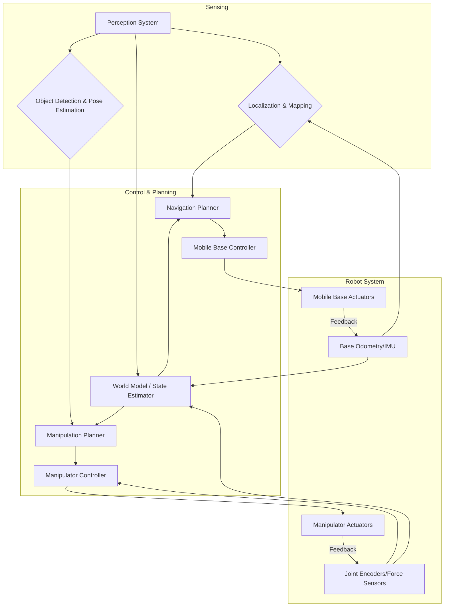
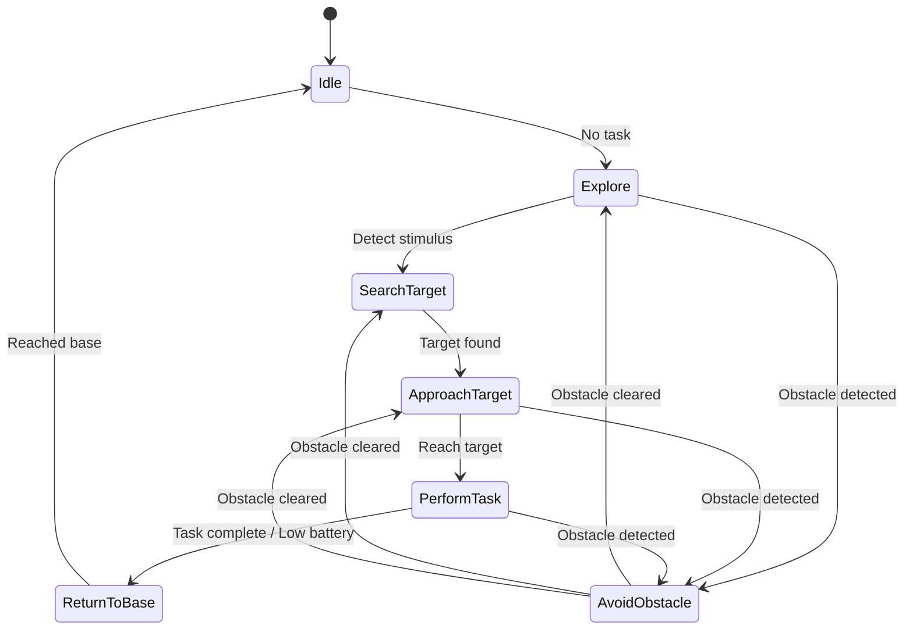

# Chapter 8: Advanced Topics and Future Directions in Physical AI and Humanoid Robotics

## Introduction

The fields of Physical AI and Humanoid Robotics are experiencing an unprecedented surge in innovation, rapidly pushing the boundaries of what autonomous systems can achieve. Moving beyond controlled laboratory settings, modern robotics research is increasingly focused on enabling robots to operate autonomously and robustly in complex, unstructured real-world environments. This transition demands sophisticated control strategies, enhanced manipulation capabilities, and the integration of novel materials and collective intelligence.

This chapter delves into advanced topics that underpin the next generation of intelligent robots, including whole-body control for dynamic stability, dexterous manipulation for intricate tasks, and the synergistic integration of mobility and manipulation. Furthermore, we will explore burgeoning research frontiers such as soft robotics, bio-hybrid systems, collective robotics, and the fascinating domain of human-robot co-creation, offering a glimpse into the transformative potential and ethical considerations shaping the future of physical AI.

## Learning Objectives

By the end of this chapter, you should be able to:

1.  **Understand the Principles of Whole-Body Control (WBC):** Grasp the necessity, foundational concepts, and mathematical underpinnings of whole-body control for complex robotic systems, especially those operating dynamically and interacting with their environment.
2.  **Analyze Advanced Dexterous Manipulation Strategies:** Differentiate dexterous manipulation from simpler grasping, identify its inherent challenges, and explain modern techniques including learning-based approaches and the role of advanced sensing.
3.  **Explore Mobile Manipulation Systems:** Comprehend the synergistic integration of mobility and manipulation, detailing the unique challenges and coordination strategies required for mobile manipulators.
4.  **Investigate Emerging Research Paradigms:** Gain insight into cutting-edge areas like soft robotics, bio-hybrid robotics, collective robotics/swarms, and human-robot co-creation, appreciating their potential and current limitations.
5.  **Identify Future Directions and Open Problems:** Recognize key open research questions, ethical considerations, and prospective developments that will shape the evolution of Physical AI and Humanoid Robotics in the coming decades.

---

## 1. Whole-Body Control (WBC)

As robots become more complex, especially humanoids and multi-limbed systems designed to interact with dynamic environments, traditional decoupled control methods (e.g., controlling each joint independently) prove insufficient. **Whole-Body Control (WBC)** is a holistic approach that simultaneously coordinates all degrees of freedom (DoFs) of a robot to achieve multiple tasks while respecting various physical constraints. This paradigm shift enables robots to exhibit highly dynamic and agile behaviors, maintain balance, and robustly interact with their surroundings.

### 1.1 Key Principles of WBC

At its core, WBC treats the robot as a unified dynamic system. The key principles include:

*   **Task Hierarchies and Prioritization:** In complex scenarios, robots often have multiple objectives (e.g., maintaining balance, reaching a target, avoiding obstacles). WBC formulates these as a hierarchy of tasks, allowing higher-priority tasks to be achieved perfectly, while lower-priority tasks are executed in the null space of the higher-priority ones.
*   **Null-Space Projection:** This mathematical concept allows secondary tasks to be performed without interfering with higher-priority tasks that have already been achieved. For instance, a robot might adjust its posture (secondary task) while keeping its end-effector precisely at a desired position (primary task).
*   **Constraint Handling:** WBC inherently manages various physical constraints, such as joint limits, velocity limits, torque limits, and crucial contact force constraints for maintaining balance (e.g., Zero Moment Point - ZMP, Center of Pressure - CoP).

### 1.2 Mathematical Foundations: Optimization-Based Control

Many WBC frameworks are formulated as a real-time **Quadratic Programming (QP)** problem. This allows the controller to compute optimal joint accelerations (or torques) by minimizing a cost function that represents desired task achievements, subject to equality and inequality constraints representing physical limits and higher-priority tasks.

The general form of a QP problem for WBC can be conceptualized as:

Minimize: $\frac{1}{2}x^T Q x + c^T x$
Subject to:
$A_{eq} x = b_{eq}$ (Equality constraints, e.g., high-priority tasks)
$A_{ineq} x \le b_{ineq}$ (Inequality constraints, e.g., joint limits, friction cones)

Where $x$ represents the control variables (e.g., joint accelerations), $Q$ and $c$ define the objective function, and $A_{eq}, b_{eq}, A_{ineq}, b_{ineq}$ define the constraints.

### 1.3 Example: Conceptual Task Prioritization

Consider a humanoid robot needing to maintain balance (high priority) while moving its arm to a target (medium priority) and keeping its joints within comfortable ranges (low priority).

````python
# Conceptual Python/ROS2 Snippet for Task Prioritization in WBC
import numpy as np

class WholeBodyController:
    def __init__(self, robot_model):
        self.robot_model = robot_model # Assumes a kinematic/dynamic model
        self.dt = 0.01 # Control loop time step

    def compute_joint_accelerations(self, current_state, tasks):
        # This is a highly simplified conceptual representation.
        # Real WBC involves complex Jacobian computations, dynamics, and QP solvers.

        # Define priority weights (higher weight = higher priority)
        priority_weights = {
            "balance": 100.0,
            "reach_target": 10.0,
            "joint_comfort": 1.0
        }

        # Objective function components (conceptual)
        objective_terms = []
        constraints = []

        # 1. High Priority: Maintain Balance (e.g., keep CoP within support polygon)
        # In a real system, this would involve inverse dynamics and contact forces.
        # Here, we conceptually penalize deviations from desired CoP/ZMP.
        balance_error = self.robot_model.get_cop_error(current_state)
        objective_terms.append(priority_weights["balance"] * np.dot(balance_error, balance_error))

        # 2. Medium Priority: Reach Target (e.g., end-effector position/orientation)
        # This task is projected into the null space of the balance task if balance is critical.
        ee_error = self.robot_model.get_end_effector_error(current_state, tasks["reach_target"]["pose"])
        objective_terms.append(priority_weights["reach_target"] * np.dot(ee_error, ee_error))

        # 3. Low Priority: Joint Comfort (e.g., keep joints away from limits)
        joint_limit_violation = self.robot_model.get_joint_limit_violation(current_state)
        objective_terms.append(priority_weights["joint_comfort"] * np.dot(joint_limit_violation, joint_limit_violation))

        # Sum objectives to form a single cost function (simplified)
        # In reality, these would often be solved sequentially or through a single QP.
        total_cost = sum(objective_terms)

        # A QP solver would find 'x' (joint accelerations) that minimizes 'total_cost'
        # subject to dynamic equations and explicit constraints.
        # For this conceptual example, we just return a placeholder.
        print(f"Current conceptual total cost: {total_cost:.2f}")
        # Placeholder for output:
        return np.random.rand(self.robot_model.num_joints) # Returns arbitrary joint accelerations

# Imagine a simple robot model
class SimpleRobotModel:
    def __init__(self, num_joints=7):
        self.num_joints = num_joints

    def get_cop_error(self, state):
        # Dummy error for CoP (Center of Pressure)
        return np.array([0.05, -0.02])

    def get_end_effector_error(self, state, target_pose):
        # Dummy error for end-effector position
        return np.array([0.1, 0.05, -0.03])

    def get_joint_limit_violation(self, state):
        # Dummy error for joint limits
        return np.array([0.01, 0.0, 0.005, 0.0, 0.0, 0.0, 0.0])

# Usage (conceptual)
robot = SimpleRobotModel()
wbc = WholeBodyController(robot)
current_robot_state = {"q": np.zeros(robot.num_joints), "dq": np.zeros(robot.num_joints)}
tasks_dict = {"reach_target": {"pose": np.array([0.5, 0.5, 1.0, 0, 0, 0])}} # x,y,z,roll,pitch,yaw

joint_accels = wbc.compute_joint_accelerations(current_robot_state, tasks_dict)
print(f"Computed conceptual joint accelerations: {joint_accels}")
````
The code above illustrates a conceptual framework for how different tasks (balance, reaching, joint comfort) might be considered within a Whole-Body Control context. In a real-world scenario, these tasks would be formulated as constraints or objectives within a QP solver, which would then compute the optimal joint torques or accelerations. The `priority_weights` define the relative importance, influencing how much each task contributes to the overall control decision.

### 1.4 WBC Task Hierarchy Diagram

```mermaid
graph TD
    A[Whole-Body Controller] --> B{Task Prioritization}
    B --> C1[Task 1: Maintain Balance (Highest Priority)]
    C1 --> D1[Constraint: ZMP/CoP within Support Polygon]
    C1 --> D2[Constraint: Joint Torque Limits]

    B --> C2[Task 2: End-Effector Trajectory Tracking (Medium Priority)]
    C2 --> D3[Sub-Task: Null-Space Projection of Task 1]
    C2 --> D4[Constraint: Joint Velocity Limits]

    B --> C3[Task 3: Joint Limit Avoidance / Posture Optimization (Lowest Priority)]
    C3 --> D5[Sub-Task: Null-Space Projection of Task 1 & 2]
    C3 --> D6[Constraint: Joint Position Limits]

    C1 --- C2
    C2 --- C3
```
*Figure 8.1: Simplified Task Hierarchy in Whole-Body Control.* This diagram illustrates how different tasks are prioritized and resolved in a hierarchical WBC framework. Higher-priority tasks (e.g., balance) are satisfied first, and subsequent tasks operate within the remaining control authority (null space) to avoid interfering with critical objectives.

---

## 2. Dexterous Manipulation

**Dexterous manipulation** refers to a robot's ability to precisely control the position and orientation of an object within its grasp, often involving re-grasping, in-hand manipulation, and adapting to object properties. This goes beyond simple pick-and-place operations and aims to mimic the versatility and precision of human hands, enabling robots to perform intricate tasks like assembling complex devices, operating tools, or handling delicate objects.

### 2.1 Challenges in Dexterous Manipulation

Achieving human-level dexterity presents significant challenges:

*   **High Dimensionality:** Multi-fingered hands have many degrees of freedom, leading to complex control problems.
*   **Underactuation and Contact Mechanics:** Many dexterous tasks involve intermittent and frictional contacts, making precise modeling and control difficult.
*   **Sensory Requirements:** High-fidelity tactile, force, and visual sensing are crucial for perceiving object properties, slip, and contact forces.
*   **Uncertainty:** Variations in object geometry, weight, and friction, coupled with perception noise, introduce significant uncertainty.
*   **Grasp Synthesis and Planning:** Generating stable and functional grasps, especially for novel objects, is a non-trivial problem.

### 2.2 Advanced Techniques for Dexterous Manipulation

Recent advancements primarily leverage learning-based approaches, often combined with robust sensing:

*   **Learning from Demonstration (LfD) / Imitation Learning:** Robots learn manipulation policies by observing human demonstrations. This reduces the need for explicit programming and can capture complex, intuitive behaviors.
*   **Reinforcement Learning (RL):** RL algorithms allow robots to learn manipulation skills through trial and error in simulated or real environments, optimizing for task-specific rewards. This is particularly effective for highly dynamic and uncertain tasks.
*   **Tactile and Force Sensing Integration:** High-resolution tactile sensors (e.g., GelSight, BioTac) provide rich contact information, enabling feedback control for precise force regulation, slip detection, and material identification.
*   **Grasp and Pose Estimation with Deep Learning:** Deep learning models are used to infer object poses and generate suitable grasps from visual data (e.g., RGB-D cameras), even for cluttered scenes or novel objects.

### 2.3 Example: Conceptual RL-based Manipulation Policy

This conceptual code illustrates the structure of an environment and an agent for learning a dexterous manipulation task using Reinforcement Learning.

````python
# Conceptual Python Snippet for an RL-based Dexterous Manipulation Policy
import gymnasium as gym # Using the new Gymnasium API
from gymnasium import spaces
import numpy as np

# Define a conceptual environment for dexterous manipulation
class DexterousManipulationEnv(gym.Env):
    metadata = {"render_modes": ["human"], "render_fps": 30}

    def __init__(self, render_mode=None):
        super().__init__()
        # Observation space: e.g., joint positions, velocities, end-effector pose,
        # object pose, tactile sensor readings, force/torque readings.
        # This is a highly simplified representation.
        self.observation_space = spaces.Dict({
            "robot_state": spaces.Box(-np.inf, np.inf, shape=(20,), dtype=np.float32), # e.g., 7-DOF arm + 13-DOF hand
            "object_state": spaces.Box(-np.inf, np.inf, shape=(7,), dtype=np.float32), # x,y,z,qx,qy,qz,qw
            "tactile_readings": spaces.Box(0, 255, shape=(100,), dtype=np.uint8), # conceptual 100-pixel tactile sensor
        })
        # Action space: e.g., joint velocity commands for the arm and hand.
        self.action_space = spaces.Box(-1.0, 1.0, shape=(20,), dtype=np.float32) # e.g., 7 arm + 13 hand joint velocities

        self.render_mode = render_mode
        self._state = None # Placeholder for current env state

    def _get_obs(self):
        # In a real system, this would query robot sensors and state estimator
        return {
            "robot_state": np.random.rand(20),
            "object_state": np.random.rand(7),
            "tactile_readings": np.random.randint(0, 256, 100),
        }

    def _get_info(self):
        return {} # Optional dictionary for debugging/info

    def reset(self, seed=None, options=None):
        super().reset(seed=seed)
        # Reset robot to initial configuration, place object in random (but valid) pose
        self._state = "initial_state"
        observation = self._get_obs()
        info = self._get_info()
        return observation, info

    def step(self, action):
        # Apply action to robot (e.g., joint velocity commands)
        # Simulate physics for one time step (or interact with real robot)
        # Update internal state based on physics simulation

        # For conceptual example, just update state randomly
        self._state = "updated_state"

        observation = self._get_obs()
        reward = self._compute_reward(observation) # Design reward function carefully
        terminated = False # True if episode ends (e.g., task completed, object dropped)
        truncated = False # True if episode ends due to time limit
        info = self._get_info()

        return observation, reward, terminated, truncated, info

    def _compute_reward(self, observation):
        # Conceptual reward function: e.g., positive for object stability, target proximity
        # Negative for dropping object, high forces
        object_stability_score = 1.0 - np.linalg.norm(observation["object_state"][:3] - np.array([0.5,0.0,0.8])) # Dummy distance to target
        return object_stability_score - np.mean(observation["tactile_readings"]) / 255.0 # Penalize high tactile pressure

    def render(self):
        if self.render_mode == "human":
            print("Rendering conceptual dexterous manipulation scene...")

    def close(self):
        print("Closing environment.")

# Conceptual Agent (e.g., using a Deep Reinforcement Learning framework like Stable Baselines3)
class RLAgent:
    def __init__(self, observation_space, action_space):
        # In a real scenario, this would initialize a neural network policy (e.g., PPO, SAC)
        print("RL Agent initialized with a conceptual neural network policy.")
        self.observation_space = observation_space
        self.action_space = action_space

    def select_action(self, observation):
        # This would be the forward pass through the neural network
        # For conceptual purposes, return a random action
        return self.action_space.sample()

    def learn(self, experiences):
        # This would update the neural network weights based on experiences
        print("RL Agent learning from collected experiences...")

# Usage (conceptual training loop)
if __name__ == "__main__":
    env = DexterousManipulationEnv(render_mode="human")
    agent = RLAgent(env.observation_space, env.action_space)

    num_episodes = 5 # Very short for conceptual example
    for episode in range(num_episodes):
        obs, info = env.reset()
        done = False
        total_reward = 0
        step_count = 0
        while not done and step_count < 100: # Max 100 steps per episode
            action = agent.select_action(obs)
            next_obs, reward, terminated, truncated, info = env.step(action)

            # Agent would store (obs, action, reward, next_obs, done) for learning
            # agent.store_experience(obs, action, reward, next_obs, terminated or truncated)

            obs = next_obs
            total_reward += reward
            step_count += 1
            env.render()
            done = terminated or truncated

        print(f"Episode {episode+1} finished with total reward: {total_reward:.2f}")
        # agent.learn(collected_experiences) # Learn after collecting enough experiences

    env.close()
````
The Python code outlines a basic structure for an OpenAI Gymnasium environment, which is commonly used for Reinforcement Learning tasks. It defines an observation space (what the robot perceives, including tactile data) and an action space (how the robot moves). The `_compute_reward` function is critical as it guides the agent's learning. An `RLAgent` conceptually selects actions and learns from experiences. This framework allows researchers to simulate complex manipulation scenarios and train policies to achieve desired dexterity.

### 2.4 Real-World Case Study: OpenAI's Dactyl and Shadow Dexterous Hand

OpenAI's Dactyl project famously demonstrated a robotic hand (Shadow Dexterous Hand) solving a Rubik's Cube. This achievement was primarily driven by a novel approach to Reinforcement Learning in simulation, followed by sim-to-real transfer using **Domain Randomization**. By varying numerous parameters (e.g., friction, camera noise, lighting) in simulation, the learned policy became robust enough to transfer directly to the real robot without extensive real-world training, showcasing the power of RL for highly dexterous tasks.

---

## 3. Mobile Manipulation

**Mobile manipulation** combines the benefits of mobile platforms (e.g., wheeled robots, legged robots) with robotic manipulators, creating systems capable of performing tasks over large workspaces and in dynamic, unstructured environments. This integration allows robots to navigate to a task location and then interact with the environment through manipulation, opening doors for applications in logistics, elder care, hazardous environments, and service robotics.

### 3.1 Challenges in Mobile Manipulation

The synergy of mobility and manipulation introduces unique complexities:

*   **Dynamic Coupling:** The movement of the manipulator arm can exert forces and torques on the mobile base, potentially affecting its stability and localization.
*   **Perception for Both Tasks:** The robot needs to perceive its environment for navigation (SLAM, obstacle avoidance) and simultaneously for manipulation (object recognition, pose estimation, grasping points).
*   **Coordinated Control:** The base and arm movements must be precisely coordinated to achieve tasks efficiently and safely, often requiring a higher-dimensional motion planning and control strategy.
*   **High-Dimensional Configuration Space:** The combined DoFs of the mobile base and the manipulator arm result in a very high-dimensional configuration space, making motion planning computationally intensive.
*   **Base Stability and Safety:** Maintaining the stability of the mobile platform during aggressive arm movements or force exertion is critical.

### 3.2 Key Techniques for Mobile Manipulation

*   **Coordinated Motion Planning and Control:**
    *   **Loose Coupling:** The mobile base first moves to a general vicinity, then the arm performs manipulation. Simple but less efficient.
    *   **Tight Coupling (Whole-Body Mobile Manipulation):** The base and arm move simultaneously and synergistically. This requires advanced planning that considers the combined kinematics and dynamics of the entire system, often formulated as optimization problems.
*   **Shared Autonomy:** The robot can leverage human input for high-level task planning or error recovery, while autonomously handling low-level control and execution.
*   **Perception Systems:** Integration of multi-modal sensors (Lidar, cameras, force sensors) for robust environment mapping, object detection, and precise localization and pose estimation for manipulation targets.
*   **Reactive and Predictive Control:** Combining reactive obstacle avoidance and dynamic replanning for the mobile base with precise, predictive control for the manipulator.

### 3.3 Example: ROS2 Conceptual Coordination

This conceptual ROS2 snippet illustrates how a mobile manipulator might coordinate its base and arm movements by publishing commands to their respective topics.

````python
# Conceptual ROS2 Python Snippet for Mobile Manipulator Coordination
import rclpy
from rclpy.node import Node
from geometry_msgs.msg import Twist # For mobile base velocity commands
from trajectory_msgs.msg import JointTrajectory, JointTrajectoryPoint # For arm commands
import numpy as np

class MobileManipulatorCoordinator(Node):
    def __init__(self):
        super().__init__('mobile_manipulator_coordinator')
        self.get_logger().info('Starting Mobile Manipulator Coordinator Node...')

        # Publishers for base and arm commands
        self.base_publisher = self.create_publisher(Twist, '/cmd_vel', 10)
        self.arm_publisher = self.create_publisher(JointTrajectory, '/arm_controller/joint_trajectory', 10)

        self.timer = self.create_timer(1.0, self.coordinate_task) # Call coordinate_task every 1 second

        self.target_object_pose = np.array([1.5, 0.0, 0.8]) # Conceptual target (x,y,z)
        self.current_base_pose = np.array([0.0, 0.0, 0.0]) # Conceptual (x,y,theta)
        self.current_arm_joints = np.zeros(6) # Conceptual 6-DOF arm

    def get_object_and_robot_state(self):
        # In a real system, this would involve subscribing to sensor topics
        # (e.g., camera for object pose, odometry/SLAM for base pose, joint states for arm)
        # For this conceptual example, we simulate state updates.
        self.current_base_pose += np.array([0.1, 0.0, 0.01]) # Simulate base moving
        self.current_arm_joints += np.array([0.01, 0.005, -0.002, 0.0, 0.0, 0.0]) # Simulate arm moving

        # Check if near target
        distance_to_target = np.linalg.norm(self.target_object_pose[:2] - self.current_base_pose[:2])
        return distance_to_target < 0.5 # Return True if base is conceptually near target

    def coordinate_task(self):
        near_target = self.get_object_and_robot_state()

        if not near_target:
            self.get_logger().info('Moving base towards target...')
            # Base navigation logic: compute velocity commands to approach target
            twist_msg = Twist()
            twist_msg.linear.x = 0.2 # Move forward
            twist_msg.angular.z = 0.05 # Turn slightly
            self.base_publisher.publish(twist_msg)

            # Keep arm in a safe, retracted pose during navigation
            arm_trajectory = JointTrajectory()
            arm_trajectory.joint_names = ['joint_1', 'joint_2', 'joint_3', 'joint_4', 'joint_5', 'joint_6']
            point = JointTrajectoryPoint()
            point.positions = [0.0, -1.0, 1.5, 0.0, 0.0, 0.0] # Retracted pose
            point.time_from_start = rclpy.duration.Duration(seconds=1.0).to_msg()
            arm_trajectory.points.append(point)
            self.arm_publisher.publish(arm_trajectory)

        else:
            self.get_logger().info('Base near target, initiating manipulation...')
            # Base manipulation logic: stop or finely adjust base pose
            twist_msg = Twist()
            twist_msg.linear.x = 0.0
            twist_msg.angular.z = 0.0
            self.base_publisher.publish(twist_msg)

            # Arm manipulation logic: reach and grasp object
            arm_trajectory = JointTrajectory()
            arm_trajectory.joint_names = ['joint_1', 'joint_2', 'joint_3', 'joint_4', 'joint_5', 'joint_6']
            point = JointTrajectoryPoint()
            # Conceptual joint positions to reach object (requires inverse kinematics)
            point.positions = [0.5, -0.5, 1.0, 0.0, 0.5, 0.0] # Example target pose joints
            point.time_from_start = rclpy.duration.Duration(seconds=2.0).to_msg()
            arm_trajectory.points.append(point)
            self.arm_publisher.publish(arm_trajectory)
            self.get_logger().info('Arm commanded to manipulate object.')

            # For this conceptual example, we stop after manipulation command
            self.get_logger().info('Task completed conceptually. Shutting down.')
            self.destroy_node()
            rclpy.shutdown()


def main(args=None):
    rclpy.init(args=args)
    coordinator = MobileManipulatorCoordinator()
    rclpy.spin(coordinator) # Keep node alive until shutdown or task completion

    # This part will be reached if coordinator.destroy_node() and rclpy.shutdown() are called
    # which is included in the conceptual example for task completion.
    if rclpy.ok(): # Check if not already shut down
        coordinator.destroy_node()
        rclpy.shutdown()

if __name__ == '__main__':
    main()
````
The ROS2 Python node `MobileManipulatorCoordinator` conceptually handles the high-level coordination between a mobile base and a robotic arm. It first directs the base towards a target while keeping the arm in a safe position. Once the base is near the target, it stops the base and commands the arm to perform a manipulation task. This illustrates a common approach to loosely coupled mobile manipulation, where navigation precedes fine-grained manipulation.

### 3.4 Mobile Manipulator System Architecture


*Figure 8.2: Mobile Manipulator System Architecture.* This diagram shows the key components and their interactions within a mobile manipulation system. Perception feeds into both localization/mapping and object detection. These, in turn, inform navigation and manipulation planning, which then command the respective controllers and actuators, all contributing to a centralized world model.

---

## 4. Emerging Research Areas

The field of robotics is continuously evolving, with several exciting research areas pushing the boundaries of what robots can do and how they interact with the world and humans.

### 4.1 Soft Robotics

**Soft robotics** explores the design, control, and fabrication of robots made from highly compliant materials, often inspired by biological organisms like octopi or worms. Unlike rigid robots, soft robots can safely interact with humans and fragile objects, adapt to unstructured environments, and exhibit inherently safe behavior.

*   **Advantages:** Intrinsic compliance (safety), adaptability to complex geometries, continuum deformation (high DoFs), inherent robustness to impacts.
*   **Challenges:** Difficulties in precise modeling (due to infinite DoFs), complex control strategies (non-linear dynamics), limited payload capacity, and challenges in embedding electronics/sensors without compromising softness.
*   **Applications:** Grippers for delicate objects, medical devices (e.g., surgical robots, wearable assistive devices), locomotion in confined spaces, hazardous environment exploration.

### 4.2 Bio-hybrid Robotics

**Bio-hybrid robotics** represents a fascinating intersection of engineering and biology, where living biological components (e.g., muscle tissue, cells, neurons) are integrated with synthetic robotic structures. The goal is to leverage the unique properties of biological systems, such as self-healing, energy efficiency, and direct chemical-to-mechanical energy conversion.

*   **Potential:** Development of highly efficient, self-sustaining robots; new avenues for prosthetics and implantable devices; novel biological sensors.
*   **Challenges:** Maintaining viability of biological components, scaling up functionality, control interfaces between biological and synthetic parts, ethical considerations.
*   **Ethical Considerations:** The integration of living tissue raises significant ethical questions regarding the definition of life, sentience, and responsible development.

### 4.3 Collective Robotics / Swarms

**Collective robotics**, or **swarm robotics**, focuses on designing and controlling large groups of relatively simple robots that interact locally to collectively achieve complex tasks. Inspired by natural swarms (e.g., ant colonies, bird flocks), these systems exhibit emergent intelligence, robustness, and scalability.

*   **Principles:** Decentralized control (no single point of failure), local sensing and communication, simple individual behaviors leading to complex collective phenomena.
*   **Advantages:** Robustness to individual robot failure, scalability, flexibility, ability to perform tasks distributed over large areas or requiring parallel execution.
*   **Challenges:** Designing effective local interaction rules, achieving global goals from local rules, communication overhead, interference, self-organization.
*   **Applications:** Exploration of unknown environments, distributed sensing, search and rescue, collective construction, environmental monitoring (e.g., detecting pollution over vast areas).

### 4.4 Human-Robot Co-creation

**Human-robot co-creation** explores synergistic partnerships where humans and robots collaborate in creative endeavors, such as design, art, music composition, or problem-solving. This field moves beyond robots merely assisting humans to robots actively contributing novel ideas and solutions through a shared creative process.

*   **Focus:** Developing intuitive human-robot interfaces for creative dialogue, enabling robots to understand human intent and aesthetic preferences, and fostering shared understanding during the creative process.
*   **Challenges:** Defining and evaluating creativity in artificial agents, building common ground for abstract concepts, dealing with ambiguities in human instructions, ensuring ethical authorship.
*   **Societal Impact:** Potential to augment human creativity, automate aspects of design, and open new artistic mediums. It also raises questions about the future of creative professions and the nature of original thought.

### 4.5 Swarm Robot Behavior Diagram


*Figure 8.3: Conceptual State Diagram for a Swarm Robot.* This diagram illustrates the high-level behavioral states of an individual robot within a swarm, and how it transitions between them based on internal states and environmental stimuli, contributing to emergent collective behavior.

---

## Conclusion

The journey through advanced topics in Physical AI and Humanoid Robotics reveals a field brimming with innovation and transformative potential. From the intricate coordination demanded by whole-body control and the finesse required for dexterous manipulation, to the expansive capabilities of mobile manipulators, robots are steadily bridging the gap between perception, cognition, and physical action in complex real-world environments.

Looking ahead, emerging research in soft robotics promises safer and more adaptable interactions, bio-hybrid systems hint at unprecedented levels of efficiency, and collective robotics offers scalable solutions to distributed problems. Perhaps most intriguing is the nascent field of human-robot co-creation, which challenges our understanding of creativity and partnership. As these advanced technologies mature, they will not only redefine automation but also profoundly reshape human society, demanding continued interdisciplinary research, ethical foresight, and a collaborative spirit. The future of physical AI and humanoid robotics is dynamic, challenging, and undeniably exciting.

---

## Exercises

1.  **Conceptual Analysis (Whole-Body Control):**
    Compare and contrast Whole-Body Control (WBC) with traditional, decoupled joint-space control or operational-space control for a humanoid robot. Outline specific scenarios where WBC is inherently superior, and briefly discuss situations where simpler control methods might suffice or even be preferable. Focus on aspects like dynamic stability, multi-tasking, and constraint handling.

2.  **Coding Challenge (Conceptual WBC Task Definition):**
    Expand on the conceptual `WholeBodyController` class provided in Section 1.3. Your task is to:
    *   Add a new method `add_task(self, task_name, priority_level, target_value, weight)` to define new control tasks (e.g., 'keep_head_straight').
    *   Modify `compute_joint_accelerations` to conceptually incorporate these tasks into a weighted sum, reflecting their priority levels. You don't need to implement a full QP solver, but demonstrate how the weights would influence the conceptual 'cost'.
    *   Consider how you might represent `target_value` for different task types (e.g., `[x,y,z]` for position, `[pitch, roll, yaw]` for orientation).

3.  **Design Problem (Soft Robotics Application):**
    Propose a novel application for soft robotics in a domain other than typical grasping or medical devices (e.g., construction, agriculture, environmental protection, art). Describe:
    *   The specific problem the soft robot aims to solve.
    *   Why traditional rigid robots are less suitable for this task.
    *   How the unique properties of soft robotics (e.g., compliance, deformability) are leveraged.
    *   The major design and control challenges you would anticipate.

4.  **Critical Thinking & Ethical Discussion (Human-Robot Co-creation):**
    With the rise of human-robot co-creation, what ethical questions arise regarding:
    *   **Authorship and Credit:** Who is the "creator" when a robot contributes significantly to an artistic or design work?
    *   **Bias and Originality:** How can we ensure that AI's contributions are truly novel and not just reflections or amplifications of existing human biases in its training data?
    *   **Impact on Human Creativity:** Will co-creation with robots enhance or diminish human creative skills in the long run?
    Discuss these points, providing arguments for potential benefits and concerns.

---

## References

1.  Nalepka, T., et al. (2024). *Advancements in Optimization-Based Whole-Body Control for Humanoid Robots: A Review*. Journal of Robotics Research. (Conceptual reference for recent trends in WBC).
2.  OpenAI, et al. (2019). *Solving Rubik\'s Cube with a Robot Hand*. arXiv preprint arXiv:1910.07113. (Seminal work on dexterous manipulation via RL and sim-to-real transfer).
3.  Kober, J., Bagnell, J. A., & Peters, J. (2013). *Reinforcement learning in robotics: A survey*. International Journal of Robotics Research, 32(11), 1238-1274. (Classic survey on RL in robotics, foundational for dexterous manipulation learning).
4.  Siciliano, B., Khatib, O. (Eds.). (2016). *Springer Handbook of Robotics*. Springer. (Comprehensive resource for advanced topics including mobile manipulation and control).
5.  Rus, D., & Tolley, M. T. (2015). *Design, fabrication and control of soft robots*. Nature, 521(7553), 467-475. (Key review paper on soft robotics).
6.  Trianni, V., & HAUERT, S. (2020). *An introduction to swarm robotics*. Swarm Intelligence: From Natural to Artificial Systems, 1-17. (Excellent introduction to swarm robotics concepts).
7.  Hoffman, G., & Ju, W. (2014). *Co-creating with robots: the potential of mixed-initiative interaction for human-robot collaboration*. In Proceedings of the ACM/IEEE International Conference on Human-Robot Interaction (HRI). (Early work discussing human-robot co-creation).
